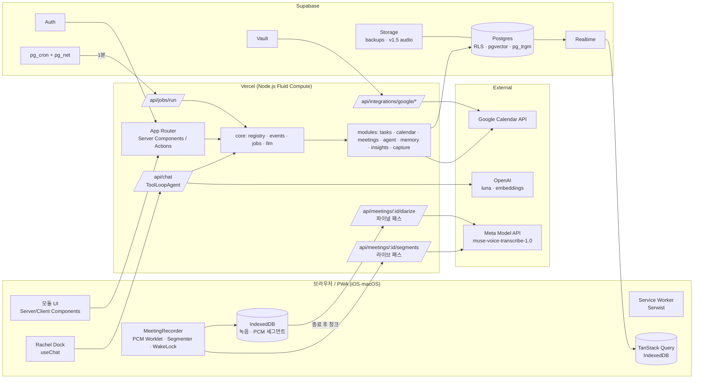

# Rachel — Architecture

| 항목 | 내용 |
|---|---|
| 버전 | v1.0 · 2026-09-02 (PRD v1.0 확정 결정 반영: Google 로그인 · 기기 오디오 보관 · Meta Muse 2패스 전사 · 비용 원장) |
| 짝 문서 | [PRD.md](./PRD.md) — 요구사항·원칙·로드맵 · [PLAN.md](./PLAN.md) — Step 단위 구현 플랜과 진행 로그. 이 문서는 "어떻게"만 다룬다. |
| 독자 | 구현자(Vincent + Claude Code). 새 모듈을 추가하기 전에 3장과 15장을 읽는다. |

> 이 문서의 API 이름(AI SDK, Supabase, OpenAI)은 2026-09-02 기준이다. 구현 시점에는 `node_modules/ai/docs/`와 각 공식 문서로 다시 확인한다. 특히 AI SDK는 메이저마다 이름이 바뀐다(`parameters→inputSchema`, `maxSteps→stopWhen`, `generateObject→generateText+Output`).

---

## 목차

1. [스택과 결정표](#1-스택과-결정표)
2. [시스템 개요](#2-시스템-개요)
3. [모듈 시스템](#3-모듈-시스템)
4. [폴더 구조](#4-폴더-구조)
5. [데이터 모델](#5-데이터-모델)
6. [에이전트 설계](#6-에이전트-설계)
7. [회의 파이프라인](#7-회의-파이프라인)
8. [캘린더 동기화](#8-캘린더-동기화)
9. [인사이트 파이프라인](#9-인사이트-파이프라인)
10. [PWA와 오프라인](#10-pwa와-오프라인)
11. [백그라운드 작업](#11-백그라운드-작업)
12. [보안](#12-보안)
13. [성능 전략](#13-성능-전략)
14. [테스트·품질·컨벤션](#14-테스트품질컨벤션)
15. [새 모듈 추가 체크리스트](#15-새-모듈-추가-체크리스트)
16. [환경변수](#16-환경변수)

---

## 1. 스택과 결정표

| 영역 | 선택 | 대안 | 이유 |
|---|---|---|---|
| 프레임워크 | **Next.js 16** App Router, React 19, Turbopack, TypeScript strict | Remix, SvelteKit | 요구사항. Server Components·Server Actions·`after()`·`proxy.ts`를 그대로 쓴다. Edge 런타임은 쓰지 않는다(Node.js Fluid Compute 기본). |
| 호스팅 | **Vercel** Hobby → 필요 시 Pro | Cloudflare | Next 최적. 크론은 쓰지 않고(Hobby 1일 1회 제한) pg_cron으로 대체. |
| DB·Auth·Storage·Realtime | **Supabase** (Postgres 15+, pgvector, pg_cron, pg_net, pg_trgm, Vault) | Neon + 별도 Auth | 요구사항. 한 서비스로 다섯 역할. RLS로 다중 사용자 대비. |
| DB 접근 | **supabase-js + 생성 타입**(`supabase gen types`) | Drizzle, Prisma | RLS를 사용자 세션으로 자연스럽게 태운다. 복잡한 집계는 SQL 뷰·RPC. |
| LLM | **OpenAI `gpt-5.6-luna`** via `@ai-sdk/openai` | Vercel AI Gateway 경유 | 요구사항. 벤더·키·청구가 하나. Gateway는 관측·폴백이 필요해지면 `models.ts` 한 줄로 전환. |
| 에이전트 런타임 | **Vercel AI SDK v6** (`ToolLoopAgent`, `tool()`, `useChat`) | LangGraph, 직접 루프 | 스트리밍·도구 루프·타입 안전 UI 메시지가 기본 제공. |
| 임베딩 | `text-embedding-3-small` 1536차원, pgvector HNSW | 512차원(halfvec) | 개인 규모에서 수년치가 수십 MB. 용량이 문제 되면 차원 축소. |
| 전사·화자 분리 | **Meta `muse-voice-transcribe-1.0`** 배치 엔드포인트, 2패스(라이브 ENDPOINTING → 파이널 DIARIZATION) | OpenAI `gpt-transcribe` 계열 | $0.003/분에 화자 분리 포함, 한국어 검증 언어, 코드스위칭. 배치 한도(10분·32MB)는 세그먼트·청크 설계로 흡수. `TranscriptionProvider` 뒤에 두어 한 줄로 교체. |
| 오디오 보관 | **기기 IndexedDB**(`idb`) — 압축 녹음(재생용) + 임시 PCM 세그먼트(파이널 패스용) | Supabase Storage | 사용자 결정(v1 로컬). 서버 무저장. v1.5에 Storage 업로드 옵션. |
| 한국어 키워드 검색 | `pg_trgm` GIN | pgroonga | 벡터 검색이 주력, trgm은 부분 문자열 보조. 정밀 형태소 검색이 필요해지면 pgroonga(Supabase 제공). |
| UI | **shadcn/ui + Tailwind v4**, lucide, `next-themes` | MUI, Radix 직접 | 요구사항. 컴팩트 밀도로 토큰 조정. |
| DnD | **@dnd-kit** | @hello-pangea/dnd | 가볍고 터치 센서·키보드 접근성. |
| 정렬 키 | **fractional index**(문자열 순서 키) | 정수 재번호 | 이동 시 1행 갱신, Realtime 충돌 최소. |
| 서버 상태 | **TanStack Query** + IndexedDB persister | SWR | 오프라인 캐시·낙관적 업데이트·재검증이 표준. |
| UI 상태 | **Zustand**(채팅 Dock, 팔레트, 녹음기) | Context | 작고 라우팅 간 유지가 쉽다. |
| 폼·검증 | **zod** + react-hook-form | valibot | 도구 입력 스키마와 폼 스키마를 공유. |
| 날짜 | `date-fns` + `date-fns-tz`, 자연어는 `chrono-node` | dayjs | 트리쉐이킹, 타임존. |
| 차트 | **shadcn charts(Recharts)** | visx | shadcn과 토큰 공유. 지연 로드. |
| PWA | **Serwist**(`@serwist/next`) | next-pwa | next-pwa는 미유지·Turbopack 비호환. Next 공식 가이드가 Serwist 권장. |
| 백그라운드 | **`jobs` 테이블 + pg_cron(1분) + `after()` 즉시 킥** | Vercel Cron, Vercel Workflow, Inngest | 무료·단순·이력이 남는다. 다단계 내구 워크플로가 필요해지면 Vercel Workflow로 승격. |
| 폰트 | 시스템 스택(`-apple-system`, `Apple SD Gothic Neo`…) 기본, Pretendard 옵션 | 웹폰트 필수 | 설치형 PWA는 시스템 폰트가 더 "네이티브"하고 0KB. |
| 린트·포맷 | **Biome** | ESLint+Prettier | 한 도구, 빠름. 모듈 경계는 `noRestrictedImports`(또는 dependency-cruiser). |
| 테스트 | **Vitest** + Testing Library, **Playwright** 스모크, **pgTAP**(RLS) | Jest | — |
| 패키지 매니저 | **pnpm** | npm | — |

---

## 2. 시스템 개요



**요청 경로 한 줄 요약**
- 화면 조회: Server Component → 모듈 `repository` → Supabase(RLS) → HTML. 클라이언트는 TanStack Query로 재검증·Realtime 반영.
- 화면 액션: Client → Server Action(모듈 `actions.ts`) → `service.ts` → `repository` + 이벤트 발행.
- 레이첼: Dock → `/api/chat` → 컨텍스트 조립 → `ToolLoopAgent`(모듈 도구) → 같은 `service.ts` → 스트리밍 응답.
- 비동기: `service`가 `enqueue()` → `jobs` 행 → `after()`로 즉시 `/api/jobs/run` 킥, 놓치면 pg_cron이 1분 내 재호출.
- 회의: 브라우저가 PCM 세그먼트를 `/api/meetings/:id/segments`로 → 서버가 Meta 배치 전사 → `transcript_segments`(라이브). 종료 후 브라우저가 기기 보관 PCM을 9.5분 청크로 `/api/meetings/:id/diarize`로 → 화자 분리 → 스티칭 → 정식 전사 → 요약 잡.

---

## 3. 모듈 시스템

### 3.1 규칙

1. 모듈은 `src/modules/<id>/`에 닫혀 있다. **다른 모듈을 import하지 않는다.** 필요하면 (a) 이벤트를 발행·구독하거나 (b) 레지스트리를 통해 도구를 호출한다.
2. 코어(`src/core`)는 모듈을 모른다. 모듈 목록은 `src/modules/index.ts` 한 곳에만 있다.
3. 모듈의 **유일한 DB 접근점은 `repository.ts`**, 유일한 비즈니스 규칙은 `service.ts`. Server Action과 도구는 둘 다 `service`를 호출하는 얇은 어댑터다.
4. 모듈이 만드는 테이블·이벤트·도구·잡 이름은 모듈 id를 접두어로 쓴다(`cards`는 예외적으로 tasks 모듈 소유 — 소유는 마이그레이션 파일명 접두어로 표시).
5. UI는 코어가 제공하는 슬롯(nav, Today 위젯, Insights 위젯, 설정 섹션, ⌘K 명령)에 **선언으로** 끼운다.

### 3.2 계약 (`src/core/contracts/`)

```ts
// module.ts
export interface ModuleManifest {
  id: string;                       // 'tasks' — 도구·이벤트·잡 접두어
  name: string;                     // '할 일'
  icon: string;                     // lucide 아이콘 이름
  nav?: { href: string; order: number; mobileTab?: boolean };
  schemaVersion: number;            // 마이그레이션 추적
}

export interface RachelModule {
  manifest: ModuleManifest;
  tools?: Record<string, AgentTool<any, any>>;      // 'create' → 'tasks.create'
  widgets?: DashboardWidget[];                      // Today / Insights 위젯
  contextProviders?: ContextProvider[];             // 레이첼 프롬프트 컨텍스트
  eventHandlers?: EventHandler[];                   // 도메인 이벤트 구독
  jobs?: Record<string, JobHandler<any>>;           // 'postprocess' → 'meetings.postprocess'
  indexers?: Indexer[];                             // 검색 인덱싱 규칙
  commands?: Command[];                             // ⌘K
  settings?: SettingsSection;                       // 설정 화면 섹션
}
```

```ts
// tool.ts
export type ToolRisk = 'read' | 'write' | 'destructive';

export interface ToolContext {
  userId: string;
  db: SupabaseClient<Database>;     // 사용자 세션 클라이언트(RLS 적용)
  actor: 'user' | 'agent' | 'system';
  now: Date;
  timezone: string;
  ui?: { route: string; entity?: { type: string; id: string } };  // 화면 컨텍스트
  emit(event: DomainEventInput): Promise<void>;
  enqueue(job: JobInput): Promise<void>;
}

export interface AgentTool<I, O> {
  description: string;
  inputSchema: z.ZodType<I>;
  risk: ToolRisk;                    // destructive → 실행 전 확인(needsApproval)
  execute(input: I, ctx: ToolContext): Promise<O>;
  undo?(output: O, ctx: ToolContext): Promise<void>;   // write 도구의 되돌리기
  Render?: ComponentType<{ input: I; output?: O; state: 'running' | 'done' | 'error' }>;  // 채팅 카드
}
```

```ts
// event.ts
export interface DomainEvent<T = unknown> {
  id: string;
  type: `${string}.${string}`;      // 'task.created' | 'meeting.summarized' | 'calendar.synced'
  entity: { type: string; id: string };
  payload: T;
  actor: 'user' | 'agent' | 'system';
  occurredAt: string;
}
export interface EventHandler {
  on: string | string[];            // 글롭 허용: 'task.*'
  handle(event: DomainEvent, ctx: ServiceContext): Promise<void>;  // 무거운 일은 enqueue로 넘긴다
}
```

```ts
// job.ts
export interface JobHandler<P> {
  schema: z.ZodType<P>;
  maxAttempts?: number;             // 기본 3
  timeoutSec?: number;              // 기본 240 (함수 한도 300 아래)
  dedupeKey?(payload: P): string;   // 같은 키의 pending 잡은 하나만
  run(payload: P, ctx: ServiceContext): Promise<void>;
}
```

```ts
// widget.ts · context.ts · indexer.ts · command.ts
export interface DashboardWidget {
  id: string; title: string;
  surface: 'today' | 'insights' | 'both';
  size: 'sm' | 'md' | 'lg'; order: number;                       // 너비: 1/4 · 1/2 · 전체(데스크톱 4열)
  rows?: 1 | 2 | 3 | 4;                                            // 높이(행 단위 9rem). 기본 sm1·md2·lg2
  placement?: 'top' | 'grid';                                      // top = 그리드 위 전체 폭·프레임 없음(캡처 바)
  href?: string;                                                   // 헤더 "열기" 링크
  load(ctx: ServiceContext, range: DateRange): Promise<unknown>;   // 서버
  Component: ComponentType<{ data: unknown; range: DateRange }>;   // 본문만 그린다 — 프레임(Panel)은 WidgetGrid 가
  HeaderAction?: ComponentType<{ data: unknown; range: DateRange }>; // 헤더 우측 컨트롤(브리핑 새로고침 등)
}
export interface ContextProvider {
  id: string;
  budgetTokens: number;                                            // 프로바이더별 상한
  build(ctx: ToolContext, userQuery: string): Promise<string | null>;
}
export interface Indexer {
  sourceType: string;                                              // 'meeting_transcript'
  on: string[];                                                    // 재인덱싱 트리거 이벤트
  chunks(entityId: string, ctx: ServiceContext): Promise<Array<{ index: number; content: string; metadata?: Json }>>;
}
export interface Command { id: string; label: string; shortcut?: string; run(ctx: { router: Router; openDock(prompt?: string): void }): void; }
```

`ServiceContext`는 `ToolContext`에서 `ui`를 뺀 것이다. 잡·이벤트 핸들러는 사용자 세션이 없으므로 **service-role 클라이언트에 `user_id`를 명시적으로 스코프한 래퍼**(`dbFor(userId)`)를 받는다. 이 래퍼는 모든 쿼리에 `.eq('user_id', userId)`를 강제한다.

### 3.3 레지스트리 (`src/core/registry/`)

```ts
// registry.ts — 모듈 배열을 받아 조립. 요청 시점에 지연 조회(순환 방지).
export class Registry {
  constructor(private readonly modules: () => RachelModule[]) {}
  tools()                 { /* { 'tasks.create': tool, ... } */ }
  jobHandlers()           { /* { 'meetings.postprocess': handler } */ }
  eventHandlers(type)     { /* 글롭 매칭 */ }
  widgets(surface)        { /* order 정렬 */ }
  contextProviders()      { }
  indexers(eventType?)    { }
  nav()                   { /* manifest.nav 있는 모듈, order 정렬 */ }
  commands()              { }
  settings()              { }
}
export const registry = new Registry(() => modules);   // modules는 src/modules/index.ts
```

```ts
// tools.ts — 도구 계약 → AI SDK tool() 어댑터
export function toAiSdkTools(defs: Record<string, AgentTool<any, any>>, ctx: ToolContext) {
  return Object.fromEntries(Object.entries(defs).map(([name, t]) => [name, tool({
    description: t.description,
    inputSchema: t.inputSchema,
    needsApproval: t.risk === 'destructive',        // AI SDK 도구 승인. 없으면 자체 confirm 스텝으로 대체
    execute: async (input) => {
      const out = await t.execute(input, ctx);
      await recordUndo(ctx, name, out, t.undo);      // 30초 Undo 토큰
      return out;
    },
  })]));
}
```

### 3.4 이벤트 버스 (`src/core/events/bus.ts`)

- `emit()`은 (1) `domain_events`에 append, (2) 같은 요청 안에서 레지스트리의 핸들러를 순차 실행(실패는 로그만, 요청을 깨지 않음).
- 핸들러는 짧아야 한다. 무거운 일(요약·인덱싱·기억 추출)은 `enqueue()`로 잡을 만든다.
- 이벤트 로그는 지표(사이클 타임, 활동 타임라인)와 감사에 재사용한다.

---

## 4. 폴더 구조

```
rachel/
├─ docs/                          PRD.md · ARCHITECTURE.md · adr/(선택)
├─ public/                        아이콘, manifest 자산
├─ src/
│  ├─ app/                        라우트는 얇다: 모듈 UI를 조립만 한다
│  │  ├─ layout.tsx               html·theme·폰트·Providers
│  │  ├─ manifest.ts              PWA 매니페스트
│  │  ├─ sw.ts                    Serwist 서비스 워커
│  │  ├─ (auth)/login/page.tsx
│  │  ├─ (app)/                   인증 필요 영역
│  │  │  ├─ layout.tsx            AppShell(nav = registry.nav()) + RachelDock
│  │  │  ├─ today/page.tsx        registry.widgets('today')
│  │  │  ├─ tasks/[boardId]/page.tsx
│  │  │  ├─ calendar/page.tsx
│  │  │  ├─ meetings/page.tsx · [id]/page.tsx · live/[id]/page.tsx
│  │  │  ├─ memory/page.tsx
│  │  │  ├─ insights/page.tsx     registry.widgets('insights')
│  │  │  ├─ capture/page.tsx      Share Target 수신
│  │  │  └─ settings/page.tsx     registry.settings()
│  │  └─ api/
│  │     ├─ chat/route.ts                       레이첼 스트리밍
│  │     ├─ jobs/run/route.ts                   pg_cron·after() 호출
│  │     ├─ integrations/google/start/route.ts · callback/route.ts
│  │     ├─ meetings/[id]/segments/route.ts     라이브 패스: 세그먼트 WAV → Muse ENDPOINTING
│  │     ├─ meetings/[id]/diarize/route.ts      파이널 패스: 청크 WAV → Muse DIARIZATION → 스티칭
│  │     ├─ transcribe/quick/route.ts           채팅 음성 입력(PUSH_TO_TALK)
│  │     ├─ push/subscribe/route.ts             (P5)
│  │     └─ export/route.ts
│  ├─ core/                       모듈이 의존하는 계약과 인프라. 모듈을 모른다.
│  │  ├─ contracts/               module · tool · event · job · widget · context · indexer · command
│  │  ├─ registry/                registry.ts · tools.ts(AI SDK 어댑터) · nav.ts
│  │  ├─ events/                  bus.ts
│  │  ├─ jobs/                    queue.ts(enqueue) · runner.ts(claim·dispatch·retry)
│  │  ├─ llm/                     models.ts(역할→모델) · pricing.ts(단가표) · client.ts(호출+원장 기록) · prompts/ · budget.ts
│  │  ├─ transcription/           provider.ts(계약) · muse.ts · openai.ts(교체용) · wav.ts(헤더·검증)
│  │  ├─ db/                      server.ts · browser.ts · admin.ts(service role, dbFor(userId)) · types.generated.ts
│  │  ├─ auth/                    session.ts(getClaims/getUser 래퍼)
│  │  ├─ realtime/                useTableChanges(table, filter)
│  │  ├─ ui/                      AppShell · MobileTabs · DesktopRail · ThemeProvider · CommandPalette · Toaster
│  │  └─ utils/                   date · cn · fractional-index · tokens(추정)
│  ├─ modules/
│  │  ├─ index.ts                 export const modules = [tasks, calendar, meetings, agent, memory, insights, capture]
│  │  ├─ tasks/
│  │  │  ├─ module.ts             RachelModule 구현(manifest · tools · widgets · indexers · events)
│  │  │  ├─ schema.ts             zod 도메인 타입(Card, Column, Board)
│  │  │  ├─ repository.ts         Supabase 쿼리 — 유일한 DB 접근점
│  │  │  ├─ service.ts            규칙: 이동·완료·검증·이벤트 발행
│  │  │  ├─ actions.ts            'use server' — service 호출만
│  │  │  ├─ tools.ts              AgentTool 정의(list·create·move·…)
│  │  │  ├─ widgets.tsx           DueTodayWidget · ThroughputWidget
│  │  │  ├─ indexer.ts            카드 → search_chunks
│  │  │  ├─ events.ts             이벤트 타입 상수 + 핸들러
│  │  │  ├─ queries.ts            TanStack Query 키·훅
│  │  │  ├─ ui/                   Board · Column · Card · CardSheet · QuickAdd
│  │  │  └─ __tests__/
│  │  ├─ calendar/                + sync.ts(증분 동기화) · google.ts(API 클라이언트)
│  │  ├─ meetings/                + recorder/(AudioCapture · pcm-worklet.ts · Segmenter · WavEncoder · AudioStore(idb) · Uploader · state.ts)
│  │  │                           + finalpass/(chunker.ts · runner.ts) · stitch.ts(서버) · postprocess.ts · hints.ts
│  │  ├─ agent/                   + dock/(RachelDock · MessageList · ToolCard) · context.ts · persona.ts
│  │  ├─ memory/                  + extract.ts · retrieve.ts · search.ts
│  │  ├─ insights/                + metrics.ts(뷰 조회) · review.ts(주간 리뷰)
│  │  └─ capture/                 + triage.ts
│  ├─ components/ui/              shadcn 생성 컴포넌트(수정 최소)
│  └─ styles/globals.css          Tailwind v4 토큰(밀도·색·반경)
├─ supabase/
│  ├─ config.toml
│  ├─ migrations/                 0001_core.sql · 0002_tasks.sql · 0003_calendar.sql · … (모듈 접두어)
│  ├─ seed.sql
│  └─ tests/                      pgTAP RLS 테스트
├─ tests/e2e/                     Playwright
├─ vercel.json · next.config.ts · biome.json · package.json · .env.example
```

---

## 5. 데이터 모델

### 5.1 공통 규칙

- 모든 테이블: `id uuid pk default gen_random_uuid()`, `user_id uuid not null default auth.uid() references auth.users on delete cascade`, `created_at`, `updated_at`(트리거).
- RLS는 표준 4정책. 마이그레이션 헬퍼 `core.enable_owner_rls(table)`이 아래를 생성한다.

```sql
alter table public.cards enable row level security;
create policy cards_select on public.cards for select to authenticated using ((select auth.uid()) = user_id);
create policy cards_insert on public.cards for insert to authenticated with check ((select auth.uid()) = user_id);
create policy cards_update on public.cards for update to authenticated
  using ((select auth.uid()) = user_id) with check ((select auth.uid()) = user_id);
create policy cards_delete on public.cards for delete to authenticated using ((select auth.uid()) = user_id);
```

- 뷰는 `with (security_invoker = true)`. `SECURITY DEFINER` 함수는 만들지 않는다(필요하면 `internal` 스키마 + `auth.uid()` 검사).
- 잡·크론 경로는 service role을 쓰되 `dbFor(userId)` 래퍼로 스코프한다.
- 인덱스 기본: `(user_id, <정렬/필터 컬럼>)`. 벡터는 HNSW(cosine).

### 5.2 core

| 테이블 | 주요 컬럼 | 비고 |
|---|---|---|
| `profiles` | `id`(= auth.users.id), `display_name`, `timezone` 'Asia/Seoul', `locale` 'ko', `settings jsonb`(테마·말투·전사 모드·오디오 보관·월 예산·대시보드 레이아웃) | 가입 트리거로 생성 |
| `integrations` | `provider`('google_calendar'), `account_email`, `scopes text[]`, `vault_secret_id`, `sync_cursor jsonb`, `status`, `last_synced_at`, `last_error` | refresh token은 Vault |
| `domain_events` | `type`, `entity_type`, `entity_id`, `payload jsonb`, `actor`, `occurred_at` | append-only. `(user_id, occurred_at desc)` 인덱스 |
| `jobs` | `type`, `payload jsonb`, `dedupe_key`, `status`(pending/running/done/failed), `run_at`, `attempts`, `max_attempts`, `locked_at`, `last_error` | `(status, run_at)` 인덱스, `dedupe_key` partial unique where pending |
| `llm_usage` | `provider`(openai/meta), `model`, `feature`(chat/summarize/extract/brief/review/embed/transcribe_live/transcribe_final/voice_input), `input_tokens`, `cached_tokens`, `output_tokens`, `audio_seconds`, `unit_prices jsonb`(기록 시점 단가), `cost_usd numeric(10,6)`, `ref jsonb`({type:'thread'\|'meeting'\|'insight', id}), `latency_ms`, `meta jsonb` | 뷰 `v_llm_usage_monthly`, `v_llm_usage_by_feature`, `v_llm_usage_daily`. 결과 옆 비용 칩은 `ref`로 조회 |
| `undo_tokens` | `tool`, `output jsonb`, `expires_at` | 30초 되돌리기 |

### 5.3 tasks

| 테이블 | 주요 컬럼 |
|---|---|
| `boards` | `name`, `position text`, `is_default`, `archived_at` |
| `board_columns` | `board_id`, `name`, `position text`, `wip_limit`, `is_done` |
| `cards` | `board_id`, `column_id`, `title`, `description_md`, `position text`, `priority smallint`(0~3), `due_at timestamptz`, `due_has_time bool`, `labels text[]`, `checklist jsonb`, `source jsonb`({type, ref_id}), `calendar_event_id`, `meeting_id`, `completed_at`, `archived_at` |

인덱스: `cards(user_id, column_id, position)`, `cards(user_id, due_at) where completed_at is null`, `cards using gin(labels)`. 이동·완료·컬럼 변경은 `domain_events`(`task.moved`, `task.completed`)로 남겨 사이클 타임을 계산한다.

### 5.4 calendar

| 테이블 | 주요 컬럼 |
|---|---|
| `calendars` | `integration_id`, `external_id`, `name`, `color`, `is_primary`, `selected`, `writable`, `sync_token` |
| `calendar_events` | `calendar_id`, `external_id`, `etag`, `title`, `description`, `location`, `start_at`, `end_at`, `all_day`, `timezone`, `recurring_event_id`, `attendees jsonb`, `status`, `html_link`, `sync_status`(synced/pending_push/conflict), `remote_updated_at`, `deleted_at` |

`unique(calendar_id, external_id)`, `(user_id, start_at)`. 로컬 생성 시 `external_id`는 임시(`local:<uuid>`) → push 성공 후 교체.

### 5.5 meetings

| 테이블 | 주요 컬럼 |
|---|---|
| `meetings` | `title`, `status`(recording/processing/ready/failed), `provider`('muse'), `final_pass_status`(pending/running/done/skipped/failed), `final_pass_progress jsonb`({done, total}), `speaker_map jsonb`({S1:'김OO'}), `audio_local_key`(기기 IndexedDB 키), `audio_mime`, `audio_uploaded_path`(v1.5), `started_at`, `ended_at`, `duration_sec`, `calendar_event_id`, `keywords text[]`, `summary jsonb`, `summary_md`, `summary_version`, `summary_model`, `bookmarks jsonb`([{at_ms, note}]) |
| `transcript_segments` | `meeting_id`, `pass`(live/final), `seq int`(라이브: 세그먼트 번호), `chunk_index`(파이널), `turn_id`, `start_ms`, `end_ms`(회의 시작 기준), `raw_speaker`(Muse의 A/B…), `speaker`(전역 S1/S2…), `text`, `status`(ok/failed), `raw jsonb` |

`summary jsonb` 스키마(zod로 고정): `{ tldr, key_points[], decisions[], action_items[{title, owner?, due?, source_seq[]}], open_questions[], participants[], followups[{title, when?}] }`.

인덱스: `transcript_segments(meeting_id, pass, start_ms)`. 화면은 `final`이 있으면 `final`, 없으면 `live`를 보여 준다. 라이브 행은 파이널 완료 후에도 남긴다(디버그·비교용, 30일 후 잡으로 정리).

### 5.6 agent · memory

| 테이블 | 주요 컬럼 |
|---|---|
| `chat_threads` | `title`, `scope jsonb`({type:'meeting', id}), `summary text`, `summary_upto_message_id`, `last_message_at` |
| `chat_messages` | `thread_id`, `role`, `parts jsonb`(AI SDK UIMessage parts), `tokens`, `created_at` |
| `memories` | `kind`(fact/preference/person/decision/goal/routine), `content`, `embedding vector(1536)`, `importance smallint`, `source jsonb`({type, id, excerpt}), `status`(active/archived), `pinned`, `last_used_at`, `use_count` |
| `search_chunks` | `source_type`, `source_id`, `chunk_index`, `content`, `embedding vector(1536)`, `metadata jsonb`, `updated_at` |

인덱스: `memories using hnsw (embedding vector_cosine_ops)`, `search_chunks using hnsw`, `search_chunks using gin (content gin_trgm_ops)`, `unique(source_type, source_id, chunk_index)`.

RPC: `match_memories(query_embedding, k, min_similarity)`, `search_chunks_hybrid(query_embedding, query_text, k, types[])` — 벡터 점수 0.7 + trgm 점수 0.3 + 최근성 보정.

### 5.7 insights · capture

| 테이블 | 주요 컬럼 |
|---|---|
| `insights` | `kind`(daily_brief/weekly_review/monthly_review), `period_start date`, `period_end date`, `content_md`, `data jsonb`, `model`; `unique(user_id, kind, period_start)` |
| `captures` | `raw_text`, `audio_path`, `origin`(text/voice/share), `status`(inbox/triaged/dismissed), `triage jsonb`(제안), `resolved_ref jsonb` |

SQL 뷰(security_invoker): `v_tasks_weekly`, `v_task_cycle_time`, `v_column_dwell`, `v_meetings_weekly`, `v_calendar_load_weekly`, `v_capture_conversion`, `v_streaks`, `v_llm_usage_monthly`.

### 5.8 Storage

- 버킷 `meeting-audio`(private). 경로 `<user_id>/<meeting_id>/<seq>.webm`.
- 정책: `(storage.foldername(name))[1] = auth.uid()::text`로 select/insert/update/delete.
- 버킷 `backups`(private). 주간 JSON 백업 `<user_id>/<date>.json.gz`.

---

## 6. 에이전트 설계

### 6.1 한 턴의 흐름 (`/api/chat`)

```
1. 인증        getClaims()로 세션 확인(빠름). 민감 작업은 getUser().
2. 컨텍스트    ToolContext 생성(userId, db, actor:'agent', ui: 요청 body의 화면 컨텍스트)
3. 조립        registry.contextProviders() 병렬 실행 → 예산(합계 ≤ 6K 토큰) 안에서 블록 결합
               - agent:  now·timezone·말투 설정
               - calendar: 오늘·내일 일정 ≤ 10
               - tasks:  마감·지연 카드 ≤ 10
               - memory: 질의 임베딩 → match_memories top-8 (+ pinned)
               - meetings: ui.entity가 회의면 그 요약 + 관련 청크 top-5
               - thread:  압축 요약 + 최근 메시지 창(≤ 20개 또는 ≤ 8K 토큰)
4. 실행        ToolLoopAgent({ model: models.chat, instructions: PERSONA(고정) , tools: toAiSdkTools(registry.tools(), ctx), stopWhen: stepCountIs(6) })
               instructions = [고정 접두어: 페르소나·규칙·도구 안내] + [동적 꼬리: 컨텍스트 블록]   ← 프롬프트 캐시 적중
5. 스트림      UI 메시지 스트림으로 응답. 도구 파트는 모듈의 Render로 카드 렌더.
6. 마무리      onFinish: chat_messages 저장, llm_usage 기록, 이벤트 chat.turn.completed,
               enqueue('memory.extract', {threadId}, dedupe: threadId, run_at: now+10m)  ← 유휴 10분 후 1회
```

**모델 역할 설정(`core/llm/models.ts`)**

```ts
export const models = {
  chat:       { model: openai('gpt-5.6-luna'), reasoning: 'low' },
  extract:    { model: openai('gpt-5.6-luna'), reasoning: 'low' },     // 구조화 출력
  summarize:  { model: openai('gpt-5.6-luna'), reasoning: 'medium' },
  review:     { model: openai('gpt-5.6-luna'), reasoning: 'medium' },
  embed:      openai.textEmbeddingModel('text-embedding-3-small'),
  transcribe: { provider: 'muse', model: 'muse-voice-transcribe-1.0', sampleRate: 16000, languageBias: ['Korean', 'English'] },
} as const;
```

모든 호출은 `core/llm/client.ts`의 `llm.generate({ role, feature, ref, ... })`를 거친다. 이 래퍼가 응답의 `usage`를 `core/llm/pricing.ts`의 단가표로 환산해 `llm_usage`에 기록하고(단가도 함께 저장), 예산이 설정돼 있으면 검사한다. 전사는 `core/transcription/`의 프로바이더가 같은 방식으로 `audio_seconds`를 기록한다. 구조화 출력은 `generateText({ output: Output.object({ schema }) })`.

### 6.2 확인과 되돌리기

| 등급 | 실행 | UI |
|---|---|---|
| read | 즉시 | 결과 카드(접힘) |
| write | 즉시 + `undo_tokens` 30초 | 결과 카드 + "되돌리기" 버튼 |
| destructive | `needsApproval` → 사용자 승인 후 실행 | 확인 카드(무엇을·몇 건·되돌릴 수 없음 표시) |

`bulkUpdate`처럼 write지만 영향 범위가 큰 도구는 `execute` 안에서 건수가 임계(기본 5)를 넘으면 `destructive`로 승격해 승인 요청한다.

### 6.3 기억 파이프라인 (memory 모듈)

```
트리거: jobs 'memory.extract' (스레드 유휴 10분 후) · 이벤트 meeting.summarized · 사용자 "기억해"
1. 입력 준비   스레드 최근 메시지(마지막 추출 이후) 또는 회의 요약+전사 요약
2. 추출        llm.generate(role:'extract', output: MemoriesSchema) → [{kind, content, importance, evidence}]
3. 중복 병합   각 항목 임베딩 → match_memories(k=3) → 유사도 ≥ 0.92면 기존 행 갱신(content 병합·importance max·source 추가)
4. 저장        신규 insert(status active, source={type, id, excerpt})
5. 인덱싱      memories도 search_chunks에 넣어 전역 검색 대상
검색: recall(query) = 벡터 top-k + pinned + 최근 사용 보정 → 사용된 기억은 use_count++, last_used_at
```

기억 화면은 이 테이블을 그대로 보여 준다. 사용자가 수정하면 임베딩을 다시 만든다.

### 6.4 페르소나(고정 접두어 요지)

- 한국어, 존댓말 기본, 결과 먼저, 3문장 안에 답한다. 필요할 때만 목록.
- 데이터를 지어내지 않는다. 확실치 않으면 도구로 확인한다.
- 기억·회의를 근거로 말할 때는 출처를 `[회의: 주간 싱크 8/28]` 형태로 단다.
- 파괴적 작업은 먼저 무엇을 할지 요약하고 승인을 받는다.
- 화면 컨텍스트가 있으면 "이 보드", "이 회의"를 그 엔티티로 해석한다.

---

## 7. 회의 파이프라인 (Meta Muse Voice Transcribe, 2패스)

### 7.0 Muse 스펙 요약 (2026-09-02, dev.meta.ai 기준)

| 항목 | 값 |
|---|---|
| 모델 | `muse-voice-transcribe-1.0` |
| 배치 | `POST https://api.meta.ai/v1/asr/transcribe?sessionId=<id>` · `Authorization: Bearer <MODEL_API_KEY>` · multipart `request`(JSON) + `audio`(WAV mono 16-bit, 16 kHz 또는 24 kHz) · **요청당 최대 10분 · 32 MB** · `Accept: application/json` \| `text/event-stream` \| `text/plain` |
| 실시간 | `wss://api.meta.ai/v1/asr/realtime?sessionId=<id>` · 첫 JSON 프레임에 `authorization.accessToken`(= API 키) · 원시 PCM 바이너리 프레임, 실시간 페이싱(백로그 5초 초과 또는 10초간 실시간 미만이면 1008 종료) · 세션 최대 60분 · 동시 8 스트림 · 시간당 1,000 스트림 |
| 모드 | `PUSH_TO_TALK`(기본, `final:true`로 종료) · `ENDPOINTING`(발화 시작·끝 감지, `speechComplete`) · `DIARIZATION`(화자 A/B… 라벨, 세션 범위, 저지연용 아님) |
| 바이어스 | `languageBias: ["Korean","English"]` · `keywords: ["이름","용어",…]`(철자 보장 없음) |
| 배치 응답 | `{ sessionId, transcript, audioDurationMs, turns: [{ turnId, startMs, endMs, transcript, speaker }] }` · 단어 타임스탬프·신뢰도 없음 |
| 가격 | $0.18/시간(= $0.003/분), 초 단위 내림, 429·실패 미과금 |
| 언어 | 25개 검증 언어에 **한국어 포함**, 코드스위칭 지원 |

설계 결론: 배치 엔드포인트만 쓴다. 실시간 엔드포인트는 키가 핸드셰이크에 들어가 브라우저 직결이 불가하고, 세션 60분·실시간 페이싱을 지키려면 상시 서버가 필요하다(v2 relay 스파이크).

### 7.1 클라이언트 캡처 (`modules/meetings/recorder/`)

```
MeetingRecorder (상태 머신: idle → requesting → recording ⇄ paused → ending → finalizing → done | error)
 ├─ AudioCapture     getUserMedia({audio:{echoCancellation:true, noiseSuppression:true, channelCount:1}})
 │                   AudioContext({sampleRate:16000}) — 브라우저가 무시하면 워클릿에서 선형 리샘플
 │                   AudioWorkletNode('pcm-capture') → Int16 PCM 블록(2,048 샘플=128ms)을 메인 스레드로 전달
 ├─ Segmenter        링버퍼 누적, 100ms 창 RMS. 규칙: 길이 ≥ 8s 이고 600ms 연속 무음(RMS < 임계) → 컷 / 길이 ≥ 20s → 강제 컷
 │                   세그먼트 전체가 무음(피크 < 임계)이면 업로드 생략(과금 방지). 컷마다 {seq, startMs, endMs, wav Blob}
 ├─ WavEncoder       44바이트 RIFF 헤더 + PCM → Blob('audio/wav'). 16kHz·mono·16bit = 32KB/s → 20s = 640KB
 ├─ MediaRecorder    같은 MediaStream, mimeType 감지('audio/webm;codecs=opus' → 'audio/mp4'), timeslice 10s
 ├─ AudioStore(idb)  DB 'rachel-audio': store 'pcm'(key `${meetingId}:${seq}`, WAV Blob + meta) · store 'rec'(key meetingId, [Blob…], mime)
 │                   첫 녹음 시 navigator.storage.persist() 요청, 설정에 estimate() 표시
 ├─ Uploader         큐(동시 2), POST /api/meetings/:id/segments, 지수 백오프 3회, 오프라인이면 대기 후 online 이벤트에 재개
 ├─ WakeLock         navigator.wakeLock.request('screen'), visibilitychange 복귀 시 재요청, 백그라운드 진입 시 배너 + 진동
 └─ Resume           진행 중 meetingId를 localStorage에 두고 새로고침·복귀 시 이어서 녹음(seq는 서버 max+1)
```

Safari(iOS)는 `AudioContext` sampleRate 옵션을 무시할 수 있다 → 워클릿이 실제 sampleRate를 보고 16k로 리샘플한다. 24 kHz는 설정으로 선택 가능(업로드 1.5배).

### 7.2 라이브 패스 (`POST /api/meetings/[id]/segments`)

```
입력  multipart { audio: WAV, seq, startMs, endMs }
1  인증·소유 확인, meetings.status = recording 확인
2  힌트 조립(hints.ts): keywords ≤ 50 = 캘린더 참석자 이름 + 사용자 사전(profiles.settings.dictionary) + 최근 카드 제목 명사 상위
3  transcription.transcribeFile({ mode:'ENDPOINTING', languageBias:['Korean','English'], keywords, audioEncoding:'WAV' }, wav)
4  turns → transcript_segments (pass='live', seq, turn_id, start_ms = startMs + turn.startMs, end_ms, text)
5  llm_usage (provider 'meta', feature 'transcribe_live', audio_seconds = floor(audioDurationMs/1000), cost = seconds/3600 × 0.18, ref {meeting})
6  반환 rows → 클라이언트가 낙관적 표시를 확정
```

호출당 수 초. Fluid Compute에서 동시 처리. 실패한 세그먼트는 `status='failed'` 행으로 남겨 화면에 "재시도" 표시(클라이언트가 IndexedDB의 WAV로 재전송).

### 7.3 파이널 패스 (`modules/meetings/finalpass/` + `POST /api/meetings/[id]/diarize`)

```
종료 시 클라이언트: meetings.finalize() → status 'processing', final_pass_status 'pending' → FinalPassRunner 시작
1  청킹(chunker.ts)  IndexedDB의 PCM 세그먼트를 startMs 순으로 이어 붙인다. 세그먼트 사이의 생략된 무음은 채우지 않고
                    오프셋 테이블 [{chunkMs, meetingMs}]로 매핑한다. 청크 길이 570s, 다음 청크는 540s 지점부터(30s 겹침).
                    16kHz 570s = 18.2MB < 32MB. 60분 회의 → 7청크. 마지막 청크가 60s 미만이면 앞 청크에 합친다(≤ 600s 확인)
2  업로드            POST /api/meetings/:id/diarize { chunkIndex, chunkCount, offsetTable, audio: WAV } 순차(동시 1), 실패 시 3회 재시도
3  서버              transcription.transcribeFile({ mode:'DIARIZATION', languageBias, keywords }, wav)
                    turns → transcript_segments (pass='final', chunk_index, turn_id, raw_speaker, start_ms/end_ms는 오프셋 테이블로 회의 시간 환산)
                    llm_usage(feature 'transcribe_final'), final_pass_progress {done, total}
4  스티칭(stitch.ts)  마지막 청크 도착 시:
                    M_0: 청크 0의 라벨 A,B,… → S1,S2,…
                    청크 k→k+1: 겹침 구간(회의 시간 기준 30s)에서 turn 쌍의 시간 겹침 길이를 (raw_k, raw_k+1) 행렬로 합산
                    → 가장 큰 셀부터 그리디 매칭 → 매핑, 남는 라벨은 새 S_n
                    겹침 구간의 중복 turn은 경계(겹침 중앙 15s) 기준으로 앞 청크는 그 이전, 뒤 청크는 그 이후 것만 남긴다
                    speaker = M_k(raw_speaker). 라벨 표시명은 speaker_map(없으면 '화자 1')
5  완료              final_pass_status 'done', emit meeting.transcribed({pass:'final'}) → enqueue meetings.postprocess (요약 v2, 화자 반영)
6  클라이언트         PCM 세그먼트 삭제(압축 녹음은 유지). 3회 실패 청크가 있으면 'failed'로 두고 라이브 전사를 정식으로 유지
```

파이널 패스는 클라이언트가 구동한다(오디오가 기기에만 있으므로). 앱을 닫으면 다음에 열 때 `final_pass_status`를 보고 이어서 진행한다. Supabase Storage 업로드 옵션(v1.5)을 켜면 같은 로직을 서버 잡으로 옮긴다.

### 7.4 후처리 잡 (`meetings.postprocess`)

```
트리거  종료 직후(라이브 전사 기준, G2 2분 목표) 그리고 파이널 패스 완료 시(화자 반영 v2)
1  전사 조립    pass 우선순위 final > live, start_ms 순, 화자 표시명 포함. 60분 ≈ 15~20K 토큰 → luna 단일 호출
2  정리+요약    llm.generate(role:'summarize', output: MeetingSummarySchema, prompt: 전사 + 북마크 + 캘린더 컨텍스트(제목·참석자))
3  저장        summary/summary_md, summary_version++, status 'ready', llm_usage(feature 'summarize', ref {meeting})
4  이벤트      emit meeting.summarized →
                 memory 핸들러: enqueue memory.extract({meetingId})
                 memory 인덱서: search_chunks 재생성(전사 300~500토큰 청크 + 요약)
                 notify(P5): 푸시 "회의 정리 완료"
```

액션 아이템은 **제안**으로만 저장된다. 리뷰 시트에서 확정하면 `tasks.createMany`(actor user, source {type:'meeting', ref_id})가 실행된다. meetings 모듈은 tasks 모듈을 import하지 않고 레지스트리 도구를 호출한다.

### 7.5 비용 (60분 회의)

| 항목 | 계산 | 비용 |
|---|---|---|
| 라이브 패스 | 60분 × $0.003 (무음 세그먼트는 생략되어 실제로는 더 적다) | ≤ $0.18 |
| 파이널 패스 | 60분 + 겹침 6×30s = 63분 × $0.003 | ≤ $0.19 |
| 요약 2회 | 2 × (20K 입력 + 2K 출력) | ≈ $0.013 |
| **합계** | | **≈ $0.38** |

회의 상세에 항목별로 표시한다(`llm_usage.ref`로 조회).

### 7.6 플랫폼 제약 (P3 첫 이틀 스파이크로 확인)

| 항목 | 상태 | 대응 |
|---|---|---|
| iOS 설치형 PWA에서 getUserMedia·AudioWorklet | iOS 14.3+ 동작(확인 필요) | 권한 안내 화면, 스파이크에서 실기기 검증 |
| 백그라운드·잠금 화면 녹음 | 불가(마이크 중단) | Wake Lock + 배너 + 진동. 세그먼트 즉시 업로드로 손실 최소화 |
| Safari MediaRecorder 포맷 | mp4/aac | 재생만 하므로 무관(Muse에는 PCM WAV를 보낸다) |
| Safari AudioContext sampleRate | 옵션 무시 가능 | 워클릿 리샘플 |
| IndexedDB 용량·정리 | iOS는 미사용 시 정리 가능 | `storage.persist()`, 용량 표시, v1.5 Storage 업로드 |
| Muse 한국어 품질 | 출시 1일차, 미검증 | 스파이크에서 실제 회의 10분 WAV로 확인. 미달이면 `openai.ts` 프로바이더로 교체 |
| 함수 실행 시간 | 기본 300초 | 세그먼트·청크 호출은 수 초~수십 초, 요약 ≤ 120초 |

### 7.6b 로컬 전사 옵션 (D13, 스파이크 후 확정)

맥(M4 Max 64GB)에서 Microsoft VibeVoice-ASR(MIT, 60분 단일 패스, 화자·타임스탬프·핫워드, 한국어)을 돌리는 **맥 워커**가 파이널 패스를 맡는 구성. 앱은 잡을 큐에 넣고, 워커(`workers/mac-transcriber/`, Python + MLX)가 service-role 키로 `meetings.final_pass` 잡을 집어가 Storage의 압축 녹음을 내려받아 전사한다. 워커가 일정 시간 안에 집어가지 않으면 서버 잡이 Muse 청크·스티칭 경로로 폴백한다. 라이브 패스는 그대로 Muse. 이 구성은 오디오가 Supabase Storage에 있어야 하므로(v1.5 항목 앞당김) 스파이크 결과에 따라 확정한다.

### 7.7 v2: 진짜 실시간(relay)

Vercel 함수는 WebSocket을 지원하지만 실행 시간 한도가 있어 60분 relay가 안 된다. 선택지: (a) 4.5분마다 relay 함수를 교체(ENDPOINTING이면 세션이 바뀌어도 무방, 화자는 파이널 패스가 담당), (b) 상시 소형 서버(Fly.io 등). 둘 다 v2 스파이크 항목.

## 8. 캘린더 동기화

### 8.1 연결

- `/api/integrations/google/start` → Google OAuth(scopes: `calendar.events`, `calendar.readonly`; `access_type=offline`, `prompt=consent`) → `/callback`에서 refresh token을 **Vault**에 저장, `integrations` 행 생성, 캘린더 목록 조회 → 선택 UI.
- 로그인(Supabase Auth)과 분리한다. 토큰 수명·재동의·권한 회수를 독립적으로 다루고, 후속 연동(노션·슬랙)이 같은 패턴을 쓴다.
- Google Cloud OAuth 동의 화면은 **프로덕션(미검증)** 상태로 둔다. 테스트 상태는 refresh token이 7일 만에 만료된다.

### 8.2 증분 동기화 (`calendar.sync` 잡)

```
for calendar in selected:
  if calendar.sync_token: events.list(syncToken)            // 변경분만
  else:                   events.list(timeMin=now-30d, timeMax=now+180d, singleEvents=true, orderBy=startTime)  // 초기
  upsert calendar_events by (calendar_id, external_id); status=cancelled → deleted_at
  on 410 GONE: sync_token=null → 초기 동기화 재실행
  save nextSyncToken → calendars.sync_token
emit('calendar.synced', {changed: n})   // Realtime이 화면 갱신
```

트리거: 앱 열 때(마지막 동기화 5분 경과, dedupe), pg_cron 15분, 로컬 쓰기 직후.

### 8.3 쓰기(write-through)

```
createEvent: 로컬 insert(sync_status=pending_push, external_id='local:<uuid>') → 즉시 UI 반영
             → Google events.insert → 성공: external_id·etag 교체, synced / 실패: pending 유지, 잡 재시도(백오프)
updateEvent: etag 조건부 갱신 → 412(충돌) 시 remote 우선 + 로컬 변경을 conflict로 표시
deleteEvent: destructive 승인 → Google delete → deleted_at
```

Google이 진실 원천이다. 오프라인에서는 pending_push가 쌓이고 온라인 복귀 시 잡이 밀어낸다.

---

## 9. 인사이트 파이프라인

```
지표(실시간, LLM 0)   SQL 뷰(v_*) ← domain_events · cards · meetings · calendar_events
위젯                  registry.widgets('today' | 'insights') → 서버에서 load() 병렬 실행 → 컴포넌트 렌더
일일 브리핑           첫 접속(05:00 이후) 또는 pg_cron 06:00 → 'insights.brief' 잡 → 오늘 일정·마감·어제 미완료·관련 기억 → luna 1회 → insights(daily_brief) 캐시
주간 리뷰             pg_cron 일 20:00 → 'insights.weekly' 잡 → 뷰 집계 + 규칙 탐지(metrics.ts) → luna 서사 1회 → insights(weekly_review) → 이벤트 → 푸시(P5)
규칙 탐지 예          회의 몰림(요일·시간대 상위 20%), 지연 상습 라벨, 사이클 타임 이상치, 완료 스트릭 끊김, 캡처→할 일 전환율 하락
AI 비용 위젯          v_llm_usage_monthly·by_feature·daily → 월 누적, 기능별(채팅·전사·요약·기억·브리핑), 모델별, 일별 추이, 회의당 평균. LLM 0회
비용 칩(CostChip)     llm_usage.ref로 조회해 채팅 응답·회의 상세·브리핑 카드 옆에 "$0.0012 · 3.1K tok" 형태로 표시
```

대시보드 레이아웃(위젯 순서·크기)은 `profiles.settings.dashboard`에 저장한다.

---

## 9b. UI 프레임 (2026-09-03 리디자인)

원칙: 미니멀·컴팩트를 유지하되 **프레임을 하나로 잠근다**. 화면마다 카드 모양·폭·높이가 달라지지 않게 코어가 프레임을 소유하고 모듈은 본문만 그린다.

| 조각 | 위치 | 규칙 |
|---|---|---|
| `Panel` | `core/ui/Panel.tsx` | 유일한 카드 프레임. 헤더 2.5rem(제목 13px·개수·우측 액션) + 본문 패딩 0.75rem, `rounded-lg border bg-card`. `fill` 이면 부모 높이를 채우고 본문이 안에서 스크롤. 위젯·설정 섹션·목록 모두 이걸 쓴다. |
| `Page` | `core/ui/Page.tsx` | 본문 폭 3종. `content`(대시보드, 1440px 까지 브라우저 폭을 따름) · `narrow`(목록·상세·설정, 48rem) · `full`(보드·캘린더, 데스크톱에서 `100dvh - 3rem` 높이 고정). |
| `PageHeader` | `core/ui/PageHeader.tsx` | 3rem 고정. 제목 + `meta`(날짜·개수) + 우측 액션. |
| `WidgetGrid` | `core/ui/WidgetGrid.tsx` | 모바일 1열 · md 2열 · xl 4열, 행 단위 9rem. `size` 가 열 span, `rows` 가 행 span. `placement: 'top'` 위젯은 그리드 위에 프레임 없이. `rowsMode="auto"`(Today) 면 행 고정을 풀고 내용 높이를 따른다. 뷰포트 채우기는 보드·캘린더처럼 스크롤 대상이 화면 자체일 때만 쓴다. 각 셀은 `Panel(title=widget.title, action=HeaderAction+href)` 로 감싼다. |
| 상태 칩 | shadcn `Badge` | 회의 상태·기억 종류·캡처 분류·패턴 모두 Badge(secondary/outline/destructive). 색은 의미(지연 red·오늘 amber·좋음 emerald)에만 쓴다. |

화면별 의도:
- **Today**(`content`, `rowsMode="auto"`): 캡처 바 → 브리핑·오늘 일정·오늘 할 일·회의 2×2. 카드는 내용 높이를 따르고 같은 줄끼리만 높이를 맞춘다. 브라우저에 맞춰 늘려서 빈 공간을 만들지 않는다(사용자 피드백 2026-09-03).
- **보드**(`full`): 컬럼이 화면 폭을 나눠 갖고(`min-w-64 max-w-sm flex-1`) 높이를 채운다. 카드 목록만 내부 스크롤, 빠른 추가는 컬럼 하단 고정. 모바일은 가로 스냅 스크롤.
- **캘린더**(`full`): 월 = 6행이 뷰포트를 채움(셀당 4개 + `+n`), 주 = 7열 균등·열 내부 스크롤, 일정 = xl 에서 2단(CSS columns).
- **인사이트**(`content`): 패턴 1행 → 처리량 3행 | 회의·일정 2행씩 → 캡처 2행 → 비용 3행(2단). 차트는 패널 높이를 채운다.
- **회의·기억·인박스·설정**(`narrow`): Panel 목록 + Badge. 설정은 섹션마다 Panel.

레이첼 Dock:
- 데스크톱: 우하단 **플로팅 창**(400×600, 확장 640×전체 높이). `Shift+Space` 또는 `⌘J` 토글, `Esc` 닫기. 입력 중(input·textarea·contenteditable)에는 Shift+Space 를 가로채지 않는다. 화면 레이아웃과 독립이라 어느 라우트에서든 바로 열린다. 열기 버튼은 레일 하단(툴팁에 단축키).
- 모바일: 하단 탭 중앙 FAB(탭 = 열기, 길게 = 음성 캡처) + 바텀 드로어 88dvh.
- 본문(`DockBody`)은 `next/dynamic` 으로 첫 열 때 로드(첫 로드 JS 에서 AI SDK 제외).

검증 도구: `OUT=<dir> node scripts/screenshots.mjs`(로컬 Supabase 빌드에서 시드 사용자 생성 → 데스크톱 1440·모바일 390 캡처).

## 10. PWA와 오프라인

| 자원 | 전략 |
|---|---|
| 앱 셸·정적 자원 | 프리캐시(Serwist `defaultCache`) |
| 페이지(RSC) | NetworkFirst, 3초 타임아웃 → 캐시 |
| `/api/chat`, `/api/meetings/*` | NetworkOnly |
| 데이터 | TanStack Query + IndexedDB persister(`idb-keyval`). 재방문 즉시 이전 데이터 표시 후 재검증 |
| Realtime | `useTableChanges('cards', 'user_id=eq.<id>')` — 보이는 화면의 테이블만 구독 |
| 오프라인 쓰기 | v1: 안내 배너. P6: 뮤테이션 아웃박스(IndexedDB) → 온라인 시 재생 |
| 매니페스트 | standalone, 아이콘(maskable 포함), shortcuts: 새 할 일 · 녹음 시작 · 레이첼, share_target → `/capture` |
| 회의 중 | Wake Lock, `beforeunload` 경고 |
| 회의 오디오 | IndexedDB(`idb`) 'rachel-audio': 압축 녹음(영구) + PCM 세그먼트(파이널 패스까지). `navigator.storage.persist()` |
| 푸시(P5) | `push_subscriptions` 테이블, `web-push` VAPID, 잡에서 발송 |

---

## 11. 백그라운드 작업

```sql
-- jobs 처리 루프 호출 (pg_cron + pg_net). URL·시크릿은 Vault에서 읽는다.
select cron.schedule('rachel-jobs', '* * * * *', $$
  select net.http_post(
    url := (select decrypted_secret from vault.decrypted_secrets where name = 'rachel_jobs_url'),
    headers := jsonb_build_object('x-cron-secret', (select decrypted_secret from vault.decrypted_secrets where name = 'rachel_cron_secret')),
    body := '{}'::jsonb)
$$);
select cron.schedule('rachel-calendar-sync', '*/15 * * * *', $$ ... enqueue calendar.sync per user ... $$);
select cron.schedule('rachel-daily-brief', '0 21 * * *', $$ ... $$);   -- 06:00 KST = 21:00 UTC 전날
select cron.schedule('rachel-weekly-review', '0 11 * * 0', $$ ... $$); -- 일 20:00 KST
select cron.schedule('rachel-backup', '0 18 * * 6', $$ ... $$);        -- 토 03:00 KST
```

`/api/jobs/run`(비밀 헤더 검증) — `update jobs set status='running', locked_at=now() where id in (select id from jobs where status='pending' and run_at <= now() order by run_at for update skip locked limit 10) returning *` → 핸들러 디스패치 → done/failed(attempts++, 지수 백오프로 run_at 재설정). `locked_at`이 10분 지난 running은 다음 루프가 회수한다. 잡 하나는 240초 안에 끝나야 하며, 길면 스스로 후속 잡을 만든다.

`enqueue()` 직후 Next.js `after()`로 같은 라우트를 한 번 호출해 지연을 없앤다. 크론은 놓친 것을 줍는 안전망이다.

---

## 12. 보안

- **RLS**: 5.1의 4정책 표준. `auth.role()`·`user_metadata`는 정책에 쓰지 않는다. UPDATE는 `USING`+`WITH CHECK`.
- **키**: 브라우저에는 Supabase publishable key만. service role·OpenAI·Google 시크릿은 서버 전용 env. `NEXT_PUBLIC_` 접두어 남용 금지.
- **토큰 저장**: Google refresh token은 Vault(`vault.create_secret`). 앱 코드는 secret id만 다룬다.
- **AI 키**: `META_MODEL_API_KEY`·`OPENAI_API_KEY`는 서버 전용. Meta Realtime은 핸드셰이크에 키가 들어가므로 브라우저 직결 금지. 브라우저는 우리 라우트에만 오디오를 보낸다.
- **크론 엔드포인트**: `x-cron-secret` 비교(타이밍 안전), 실패 시 429/401 로그.
- **채팅 남용 방지**: 사용자별 시간당 턴 상한(기본 120), 월 예산 초과 시 선택 기능 차단.
- **오디오**: v1 서버 무저장(기기 IndexedDB). Storage 업로드 옵션(v1.5) 시 private 버킷 + user_id 경로 정책, 서명 URL 60초.
- **헤더**: CSP(`connect-src`에 Supabase·OpenAI Realtime 도메인), `frame-ancestors 'none'`, HSTS.
- **라우트 보호**: `proxy.ts`에서 `(app)` 그룹 세션 검사. 서버 컴포넌트는 `getClaims()`, 결제·삭제류는 `getUser()`.
- **의존성**: 버전 고정, lockfile 커밋, `pnpm audit` CI.
- **데이터 권리**: `/api/export`(전량 JSON), 계정 삭제 시 cascade + Storage 정리 잡.

---

## 13. 성능 전략

1. **목록은 Server Components**로 첫 HTML에 담는다. 클라이언트 컴포넌트는 인터랙션 단위로만.
2. **낙관적 업데이트**: 카드 이동·완료·채팅 전송은 서버 응답을 기다리지 않는다. 실패 시 롤백 + 토스트.
3. **지연 로드**: DnD 센서, 차트, 마크다운 렌더러, 녹음기는 해당 화면에서만 `dynamic()`.
4. **캐시 계층**: RSC 캐시(짧은 revalidate) → TanStack Query(IndexedDB) → Realtime 무효화. 같은 데이터는 한 번만 가져온다.
5. **프롬프트 캐시**: 시스템 프롬프트·도구 정의를 바이트 단위로 고정하고 동적 컨텍스트는 뒤에 붙인다(luna 캐시 입력 1/10 가격).
6. **번들 예산 CI**: `next build` 출력에서 Today 라우트 첫 JS ≤ 180KB gzip 검사.
7. **이미지·폰트**: 아이콘은 lucide 트리쉐이킹, 폰트는 시스템 스택, 아바타 없음.
8. **DB**: 모든 필터 컬럼에 `(user_id, …)` 복합 인덱스, 벡터 HNSW, 뷰는 주간 집계에만. `supabase db advisors`를 마이그레이션마다 실행.

---

## 14. 테스트·품질·컨벤션

| 층 | 도구 | 대상 |
|---|---|---|
| 단위 | Vitest | `service.ts`(규칙), 도구 입력 스키마, Segmenter(합성 오디오), 요약 스키마 파서, fractional index |
| 통합 | Vitest + 로컬 Supabase(`supabase start`) | repository 쿼리, RPC(`match_memories`), 잡 러너 |
| RLS | pgTAP(`supabase test db`) | 다른 user_id로 select/update가 0행인지 |
| E2E | Playwright(모바일 뷰포트 포함) | 로그인 → 카드 생성/이동 → 레이첼로 카드 생성 → 회의 시작/종료(모킹 전사) |
| 정적 | Biome, `tsc --noEmit`, `supabase gen types` diff | 모듈 경계 import 금지 규칙 포함 |

**컨벤션**
- 파일명 kebab-case, 컴포넌트 PascalCase, 훅 `useX`. 모듈 내부 경로 별칭 `@/modules/tasks/*`, 코어 `@/core/*`.
- 마이그레이션 `NNNN_<module>_<desc>.sql`. 테이블은 snake_case 복수형.
- 이벤트 이름 `<entity>.<past-tense>`: `task.created`, `meeting.summarized`. 도구 `<module>.<verb>`.
- 서버 액션은 `actions.ts`에만, `'use server'` 파일에 비즈니스 로직 금지.
- 커밋: Conventional Commits(`feat(tasks): …`). PR에는 모듈 체크리스트(15장) 첨부.
- LLM 프롬프트는 `core/llm/prompts/<feature>.ts`에 문자열 상수 + 버전 주석. 결과 스키마는 zod로 옆에.

---

## 15. 새 모듈 추가 체크리스트

예: "journal"(저널) 모듈을 추가할 때. **코어 수정 0줄**이 목표.

- [ ] `src/modules/journal/` 생성: `module.ts`, `schema.ts`, `repository.ts`, `service.ts`, `actions.ts`, `tools.ts`, `ui/`
- [ ] `supabase/migrations/00NN_journal_init.sql`: 테이블 + `core.enable_owner_rls('journal_entries')` + 인덱스
- [ ] `supabase gen types` 재생성
- [ ] `tools.ts`: 최소 `list · get · create · update · delete(destructive)`. 각 도구에 `risk`, write 도구에 `undo`
- [ ] (선택) `widgets.tsx`: Today 또는 Insights 위젯
- [ ] (선택) `indexer.ts`: 검색·RAG 대상이면 청크 규칙
- [ ] (선택) `events.ts`: 발행 이벤트 상수, 구독 핸들러
- [ ] (선택) `contextProviders`: 레이첼이 기본으로 알아야 할 것(예산 ≤ 800토큰)
- [ ] (선택) `commands`, `settings`
- [ ] `src/modules/index.ts`에 `journal` 한 줄 추가
- [ ] 테스트: service 단위 + RLS pgTAP + (핵심 흐름이면) Playwright 1개
- [ ] 문서: PRD 5장에 절 추가, 도구 목록 갱신

---

## 16. 환경변수

| 이름 | 범위 | 용도 |
|---|---|---|
| `NEXT_PUBLIC_SUPABASE_URL` | 공개 | Supabase 프로젝트 URL |
| `NEXT_PUBLIC_SUPABASE_PUBLISHABLE_KEY` | 공개 | 브라우저 클라이언트 키 |
| `SUPABASE_SECRET_KEY` | 서버 | 잡·크론 경로의 service role(`dbFor(userId)` 래퍼로만 사용) |
| `OPENAI_API_KEY` | 서버 | luna · 임베딩 |
| `META_MODEL_API_KEY` | 서버 | Muse Voice Transcribe(라이브·파이널 패스, 음성 입력). dev.meta.ai에서 발급 |
| `GOOGLE_CLIENT_ID` / `GOOGLE_CLIENT_SECRET` | 서버 | 캘린더 OAuth |
| `GOOGLE_REDIRECT_URI` | 서버 | `/api/integrations/google/callback` |
| `CRON_SECRET` | 서버 | `/api/jobs/run` 검증(Vault의 `rachel_cron_secret`와 동일 값) |
| `APP_URL` | 서버 | 절대 URL(`after()` 킥, OAuth) |
| `VAPID_PUBLIC_KEY` / `VAPID_PRIVATE_KEY` | 공개/서버 | 웹 푸시(P5) |
| `LLM_MONTHLY_BUDGET_USD` | 서버(선택) | 미설정이면 경고 없이 표시만 |
| `AI_GATEWAY_API_KEY` | 서버(선택) | Gateway 경유로 전환할 때만 |

`.env.example`을 커밋하고 실제 값은 `vercel env pull`로 받는다.
