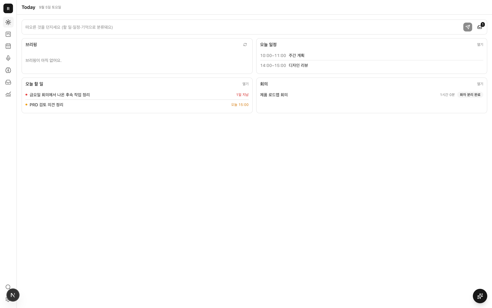
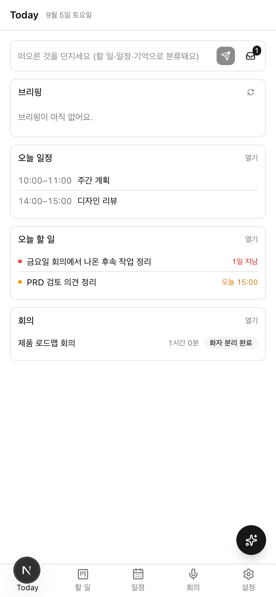
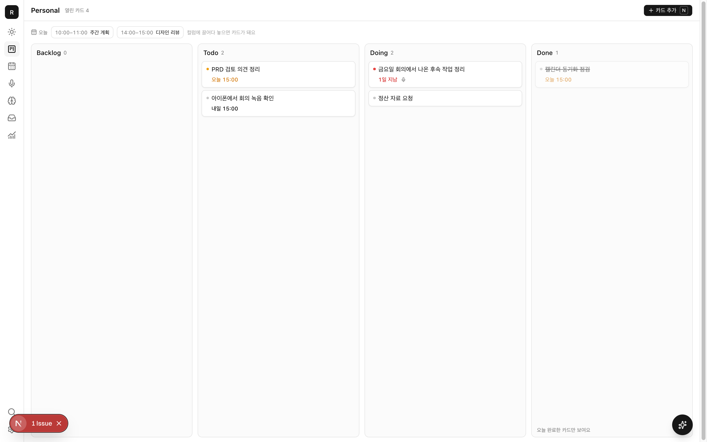
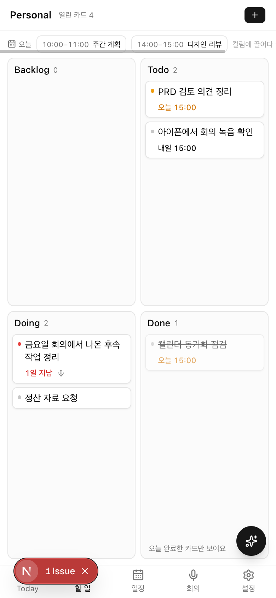
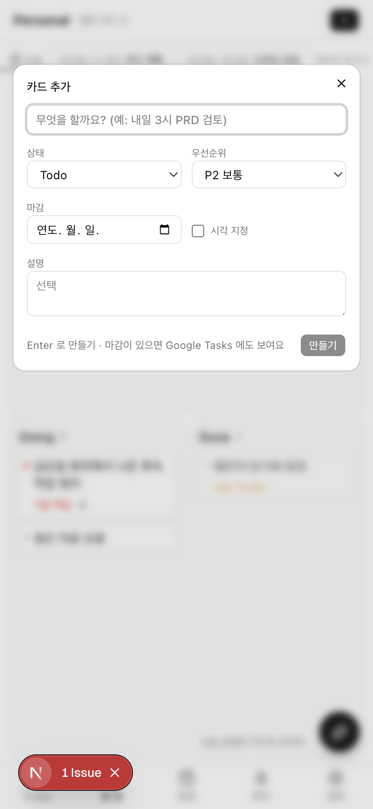
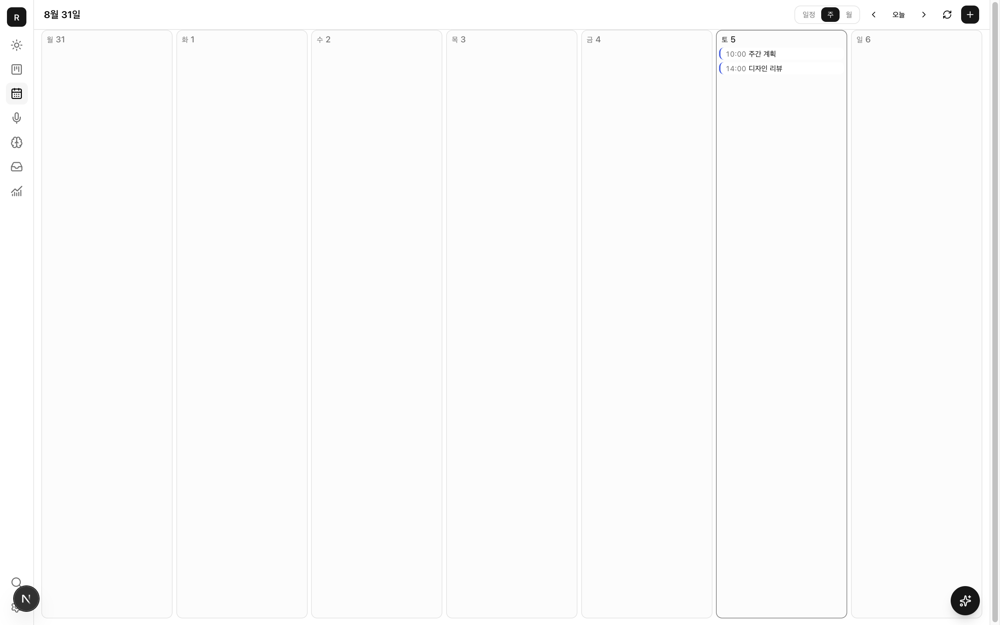
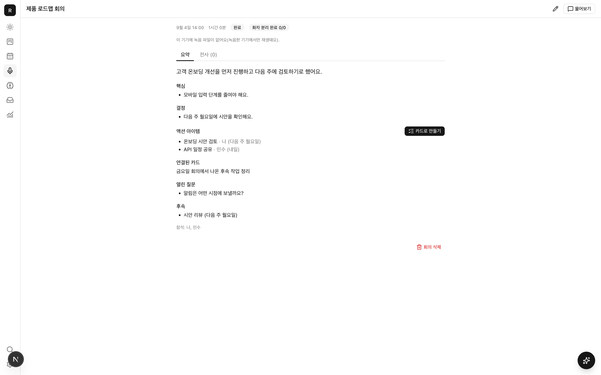
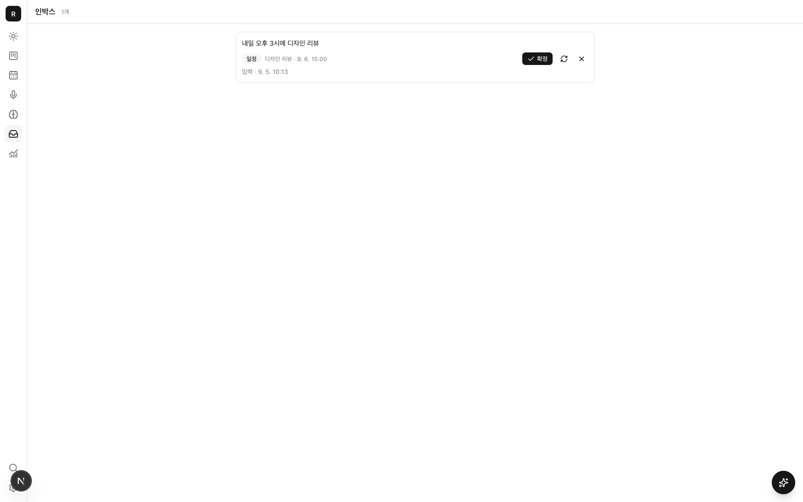

# 레이첼 기능·UX·UI 개선 검토

검토일: 2026-09-05. 대상: 현재 저장소의 개인 비서 서비스. 사용 맥락: 개인의 투두·캘린더·회의록, 모바일과 데스크톱의 일상 사용.

## 판단

레이첼의 가장 큰 기회는 **기록한 내용을 다음 행동까지 연결하고, 그 결과를 믿을 수 있게 만드는 것**이다. 칸반·일정·회의·기억·수집함·브리핑·검색·알림·되돌리기가 이미 있다. 우선순위는 기능 수보다 입력 후 재정리, 화면 이동, 중복 생성, 저장 여부 재확인을 줄이는 데 둔다.

추천 순서는 ① 저장·날짜·중복·녹음 신뢰성 ② 오늘 화면에서 바로 처리하기 ③ 회의 후속 작업 완결 ④ 화면 맥락을 이해하는 AI ⑤ 모바일 밀도 조정이다. 새로운 외부 연동이나 자동 일정 재배치는 그 뒤다.

## 근거와 한계

- **코드 확인:** 현재 구현의 컴포넌트, 서비스, 도구, 데이터 구조를 직접 읽었다. 아래 파일 링크는 이 저장소 기준이다.
- **실행 확인:** 날짜 파서를 같은 입력과 다른 기준일로 실행했다. 관련 기존 테스트 3개 파일, 8개 테스트가 통과했다. 로컬 브라우저 실행에서 캘린더 자동 동기화 예약 오류도 확인했다(R6). Calendar 테스트는 로컬 미러 기준이며 실제 Google 왕복 테스트가 아니다.
- **브라우저:** 운영 주소는 인증 화면까지만 접근 가능했다. 별도 로컬 테스트 계정과 예시 데이터로 데스크톱 1440×900 및 모바일 390×844 화면을 확인하고 원본 캡처 8장을 남겼다. 레이첼 패널도 열어 초기 상태를 확인했다. 실제 사용자의 데이터·행동 로그는 평가 근거에 포함하지 않았다.
- **추론:** 사용 빈도, 실수율, 시간 절감 효과와 우선순위는 제품 판단이다. 사용자가 실제로 겪었다고 단정하지 않는다.
- 실제 Luna 응답 품질, iPhone 키보드·백그라운드 녹음, 푸시 전달, 네트워크 단절, 스크린리더는 이번 검토로 검증하지 않았다. 접근성 준수 여부도 확정하지 않는다.
- 앱 코드와 운영 데이터는 수정하지 않았다. 보고서와 화면 캡처만 결과물로 남긴다.

## 이미 있는 기능 중 유지할 것

- 한국어 자연어 마감 파서, 키보드 단축키, 칸반 드래그, 완료 기록.
- Google Calendar와 Google Tasks 연동. 일정에서 연결된 할 일로 전환하는 드래그.
- 임박 일정에서 녹음 진입, 실시간 전사, 중요 표시, 화자 분리, 타임스탬프 재생, 요약 재생성.
- 회의 액션의 선택적 카드 생성과 연결 카드의 완료 표시.
- 화면 어디서나 여는 레이첼, 도구 실행 내역, 위험한 작업 승인, 일부 변경의 되돌리기.
- 기억의 수정·출처·고정, 전역 검색, 텍스트·음성 캡처, 일일 브리핑과 주간 리뷰.

이 기능들은 새로 만들 대상이 아니다. 아래 제안은 노출·연결·복구의 완성도를 높이는 데 초점을 맞춘다.

## 먼저 해결할 신뢰성 문제

P0는 출시 차단을 단정하는 표기가 아니라, 다른 개선보다 먼저 재현·보완할 우선순위다.

| ID | 현재 근거와 영향 | 제안 | 완료 기준 | 규모 |
|---|---|---|---|---|
| R1 · P0 | [Board.run](../../../src/modules/tasks/ui/Board.tsx#L198)은 실패를 잡아 `undefined`로 반환한다. [CardSheet.save](../../../src/modules/tasks/ui/CardSheet.tsx#L61)는 await 후 dirty를 해제한다. 새 카드도 같은 경로를 거쳐 폼을 닫는다. 실패와 오프라인 대기를 성공으로 오인할 수 있는 코드 경로다. | `저장 중 / 저장됨 / 기기에 저장·전송 대기 / 저장 실패`를 구별하고 실패 시 입력을 보존한다. 오류 결과를 폼까지 전달한다. | 서버 실패를 주입했을 때 저장됨 표시·폼 초기화가 발생하지 않고 재시도가 가능하다. | 중 |
| R2 · P0 | [ReviewSheet](../../../src/modules/meetings/ui/ReviewSheet.tsx#L38)는 기한을 파싱할 때 회의 날짜를 넘기지 않는다. [파서](../../../src/modules/tasks/parse-due.ts)는 현재 날짜를 기본값으로 쓴다. | 회의 시각·타임존을 기준으로 기한을 확정하고, 원문과 절대 날짜를 함께 표시한다. 애매한 표현은 기한 미정으로 남겨 확인한다. | 9/4 회의의 ‘내일’을 9/7에 검토해도 9/5로 표시한다. | 작음~중 |
| R3 · P0 | [회의 카드 생성](../../../src/modules/meetings/review-actions.ts)은 선택 항목을 매번 생성하며 액션별 생성 기록을 검사하지 않는다. [캡처 확정](../../../src/modules/capture/service.ts)의 resolve도 이미 resolved인지 먼저 차단하지 않는다. | 회의 액션·캡처마다 같은 요청을 반복해도 결과가 하나만 생기게 하고, 일부 성공 후 재시도는 남은 항목만 처리한다. UI에는 ‘이미 추가됨’을 표시한다. | 더블 탭, 재열기, 통신 재시도, 중간 실패 후 재실행에서도 중복 카드·일정이 생기지 않는다. | 중 |
| R4 · P0 검증 | [LiveScreen](../../../src/modules/meetings/ui/LiveScreen.tsx)은 진입 때 새 Recorder를 시작한다. [Recorder](../../../src/modules/meetings/recorder/recorder.ts)는 녹음 조각 번호를 0부터 시작하고, [audioStore](../../../src/modules/meetings/recorder/audio-store.ts)는 회의 ID와 번호로 put한다. 같은 회의 재진입 시 기존 조각과 충돌할 위험이 있다. 실제 오디오 덮어쓰기는 이번에 재현하지 않았다. | 중단된 녹음 발견 → 보존된 분량 안내 → 이어 녹음/저장된 분량으로 마무리. 이어 녹음은 새 세션 구분 또는 기존 번호·오프셋 복원을 보장한다. | 녹음 중 화면 이탈·재진입·새로고침 후 앞부분이 보존되고 재생 시간·전사가 일치한다. | 중~큼 |
| R5 · P1 | [EventChip](../../../src/modules/calendar/ui/EventChip.tsx)은 동기화 대기·충돌을 표시하지만 [EventSheet](../../../src/modules/calendar/ui/EventSheet.tsx)는 저장 완료 안내 후 닫힌다. [pushOne](../../../src/modules/calendar/events.ts)은 전송 실패를 pending으로 유지한다. | 레이첼 저장과 Google 반영을 구별한다. 충돌 시 양쪽 값·수정 시각을 비교해 선택하고, 재연결·재시도를 같은 위치에서 제공한다. | Google 연결 실패 시에도 ‘Google 반영 완료’로 오인하지 않으며 다음 행동이 보인다. | 중 |
| R6 · P0 | **로컬 실행에서 확인:** 앱 진입 후 `[calendar] trigger failed`와 `used cookies() inside after() while rendering` 오류가 기록됐다. [레이아웃](../../../src/app/(app)/layout.tsx#L18)의 after → [maybeTriggerSync](../../../src/modules/calendar/trigger.ts#L15) → [DB 클라이언트](../../../src/core/db/server.ts#L8)의 cookies 호출이 원인이다. | 요청에 필요한 인증·쿠키 정보를 after 밖에서 확보해 전달한다. 현재 Next.js 가이드에 맞춰 앱 진입 자동 동기화 경로를 수정하고 마지막 성공 시각을 사용자에게 보여준다. | 앱 진입 시 오류 없이 오래된 일정의 동기화 잡이 한 번 예약된다. Google 실제 왕복은 별도 검증한다. | 작음~중 |

날짜 실행 근거: `내일`을 2026-09-04 기준으로 파싱하면 9/5 23:59 KST, 2026-09-07 기준이면 9/8 23:59 KST였다. 파서 자체의 상대일 계산은 자연스럽지만, 회의 검토 호출부에 기준일 전달이 빠져 있다.

## 매일 쓰는 투두와 오늘 화면

| ID | 현재 확인 | 개선안과 이유 | 완료 기준 |
|---|---|---|---|
| T1 · P1 | [오늘 할 일](../../../src/modules/tasks/widgets.tsx#L13) 행은 텍스트이고 완료·상세 동작이 없다. [오늘 일정](../../../src/modules/calendar/widgets.tsx)도 행 단위 상세 진입이 없다. | 오늘 화면의 할 일에 체크·상세·내일로 미루기, 일정에는 상세·회의 준비를 붙인다. 전체 목록으로 이동하지 않고 실제 일을 끝내게 한다. | 오늘 할 일 한 건을 화면 이동 없이 완료, 세부 내용은 한 번 눌러 열기. |
| T2 · P1 | 오늘 할 일 조회는 오늘 마감과 연체만 포함한다. | `오늘 하기로 한 일`을 마감과 별도로 고를 수 있게 한다. `오늘 핵심 3개`는 추천 기본값이며 강제 제한은 두지 않는다. 연체는 별도 묶음으로 정리·재계획한다. | 마감 없는 중요한 일을 오늘 계획에 넣어도 원래 마감이 바뀌지 않는다. |
| T3 · P1 | [모바일 보드](../../../src/modules/tasks/ui/Board.tsx)는 고정 2×2 구역, 구역 안 스크롤이다. | 모바일은 상태 탭 + 한 열 목록을 기본 후보로 테스트하고 보드 전환을 남긴다. 카드 제목·완료·기한을 한눈에 읽게 한다. 2×2는 적은 카드로 전체 상태를 보는 장점이 있으므로 실제 사용 비교 후 결정한다. | 390px 화면에서 긴 제목을 구별하고, 한 손으로 완료·이동·찾기가 가능하다. |
| T4 · P1 | [새 카드](../../../src/modules/tasks/ui/NewCardDialog.tsx)는 처음부터 상태·우선순위·날짜·시각·설명을 보여준다. | 기본은 제목 한 줄 + 해석된 마감 칩 + 추가. 나머지는 ‘세부 설정’에 둔다. 날짜 해석 칩에는 취소·직접 변경을 제공한다. | 흔한 할 일 추가가 제목 입력과 Enter로 끝나며 날짜 자동 추출을 끌 수 있다. |
| T5 · P1 | [필터 스키마](../../../src/modules/tasks/schema.ts)는 오늘·연체·라벨·우선순위를 지원하지만 보드 화면에는 필터 UI가 없다. | `전체 / 오늘 / 지연`과 검색부터 노출한다. 우선순위·라벨은 추가 필터로 둔다. | 쌓인 보드에서 지연 카드만 한 번에 볼 수 있다. |
| T6 · P1 | 체크리스트는 데이터와 도구에 있고 [카드](../../../src/modules/tasks/ui/Card.tsx)는 개수를 표시하지만 상세에서 편집하지 못한다. 보관 버튼은 있지만 보드에서 보관함 복구 진입을 찾기 어렵다. | 카드 상세에 체크리스트 추가·완료와 보관함/복구를 노출한다. 새 투두 시스템을 만들 필요는 없다. | AI가 만든 체크리스트도 직접 수정할 수 있고 실수로 보관한 카드를 찾을 수 있다. |
| T7 · P2 | [카드 구조](../../../src/modules/tasks/schema.ts)에 반복 규칙이 없다. | 매주 정산·회의 준비처럼 실제 반복하는 일부터 단순 반복 투두를 추가한다. 정해진 요일 반복과 완료 후 N일 반복을 구별한다. | 반복 카드 완료 이력이 유지되고 다음 회차가 중복 없이 생긴다. |

## 캘린더를 실행 계획으로 연결

| ID | 현재 확인 | 개선안과 이유 | 완료 기준 |
|---|---|---|---|
| C1 · P1 | [기본 뷰](../../../src/app/(app)/calendar/page.tsx)는 기기와 관계없이 월간이다. [주간 뷰](../../../src/modules/calendar/ui/WeekView.tsx)는 요일별 목록으로 시간축이 없다. | 모바일 기본은 아젠다 후보, 데스크톱은 시간축 주간 후보로 삼는다. 마지막 사용 뷰를 기억한다. 겹친 일정·빈 시간을 눈으로 이해할 수 있게 한다. | 다음 일정과 빈 30분을 찾기 위해 여러 일정을 읽어 계산할 필요가 없다. |
| C2 · P1 | 일정→카드 연결은 이미 있다. 카드 상세에는 작업 시간을 확보하는 직접 동작이 없다. | `시간 잡기`에서 30/60/90분과 가능한 시간 2~3개를 보여준다. 확정하면 원본 할 일과 시간 블록을 연결한다. **마감일·실행 시간·Google Tasks 날짜는 서로 다른 의미로 유지한다.** | 카드 하나가 일정 확보 때문에 복제되지 않고, 시간 변경이 마감 변경으로 이어지지 않는다. |
| C3 · P1 | [빈 시간 도구](../../../src/modules/calendar/events.ts#L278)가 있으나 종일 일정을 전부 제외한다. 마지막 후보의 종료를 요청 범위 끝으로 제한하는 코드도 없다. | ‘종일 표시’와 ‘하루를 비우는 휴가’를 구별하고, 범위·근무시간·기존 일정·이동 여유에 맞는 후보만 제시한다. 선호 시간은 명시한 경우 적용한다. | ‘오늘 10~11시 중 90분’은 후보 없음. 하루 휴가에는 집중 시간 제안 없음. |
| C4 · P1 | [일정 폼](../../../src/modules/calendar/ui/EventSheet.tsx)은 제목·시간·장소·설명 위주이고 [새 일정](../../../src/modules/calendar/ui/CalendarScreen.tsx)은 09~10시 기본값이다. | 시간 선택으로 폼을 열면 선택한 시간을 이어받고, 시작 변경 시 기존 길이를 유지한다. 읽기 전용·반복 일정의 수정 범위를 저장 전에 설명한다. 회의 일정에는 관련 회의록/녹음 진입을 제공한다. | 사용자가 눌렀던 시간과 다른 09시 일정이 실수로 생기지 않는다. |
| C5 · P1 | [알림 종류](../../../src/modules/notify/constants.ts)에 마감 임박이 있지만 [알림 모듈](../../../src/modules/notify/module.ts)의 이벤트 처리는 회의 요약·일일 브리핑·주간 리뷰 중심이다. 마감 임박을 예약하는 실행 경로는 이번 검색에서 발견하지 못했다. | 일정 전·시각 있는 마감 전 알림을 실제로 연결한다. 날짜만 있는 할 일은 아침 묶음으로, 시각이 있는 일은 필요한 시점에 알린다. 조용한 시간과 Google 중복 알림을 고려하고 바로 완료/잠시 미루기를 연결한다. | 토글 표시뿐 아니라 예약·발송·취소·시간 변경 후 재예약이 검증된다. |

## 회의 전후의 일 연결

| ID | 현재 확인 | 개선안과 이유 | 완료 기준 |
|---|---|---|---|
| M1 · P1 | [임박 일정 위젯](../../../src/modules/meetings/widgets.tsx)에 녹음 시작이 이미 있다. | 회의 전 카드에 이전 회의 결정·미완료 후속 할 일·오늘 의제를 짧게 붙인다. AI 생성 의제는 제안으로 표시한다. | 회의 시작 전에 지난 결정과 미완료 항목을 한 화면에서 확인한다. |
| M2 · P1 | [ReviewSheet](../../../src/modules/meetings/ui/ReviewSheet.tsx)는 다른 담당자의 액션까지 기본 전체 선택한다. 제목·담당·날짜는 읽기 중심이다. | `내 할 일 / 다른 사람에게 확인할 일 / 일정 / 참고`를 구별한다. 본인 명시 항목만 기본 선택하고 담당 불명은 미정으로 표시한다. 제목·기한을 검토 중 수정한다. 개인 서비스에 팀 관리 화면까지 만들 필요는 없다. | 다른 사람의 일을 무심코 내 Todo에 넣지 않고, 확인할 일을 따로 추적한다. |
| M3 · P1 | [연결 카드 링크](../../../src/modules/meetings/ui/MeetingDetail.tsx#L255)는 `/tasks`로 이동한다. [카드 상세](../../../src/modules/tasks/ui/CardSheet.tsx)는 회의·일정 원문 링크를 표시하지 않는다. | 회의→정확한 카드 상세, 카드→원본 회의·해당 발언, 일정→회의록의 왕복 링크를 만든다. 생성 후에도 미완료·완료 상태를 보여준다. | ‘이 일은 왜 해야 하지?’를 원본 발언까지 1~2회 조작으로 확인한다. |
| M4 · P1 | [액션 스키마](../../../src/modules/meetings/schema.ts)에 sourceSeq가 있지만 액션 표시에서 활용하지 않는다. 전사 타임스탬프 재생은 이미 있다. | 액션에 근거 발언 열기를 연결하고, 회의 요약의 핵심 결정도 출처로 이동할 수 있게 확장한다. 화자와 기한을 추정한 경우 명시한다. | AI 요약을 믿기 전에 전사 전체를 다시 읽지 않아도 된다. |
| M5 · P1 | [회의 목록](../../../src/app/(app)/meetings/page.tsx)은 최근 50개 중심이다. 검색·기간·미처리 후속 필터가 없다. | 목록에 검색, 월별 묶음, ‘후속 작업 남음’ 필터와 이전 기록 불러오기를 추가한다. 자주 쓰는 것은 요약 첫 문장과 다음 할 일 수다. | 한 달 전 특정 회의를 찾고 남은 후속 일을 확인할 수 있다. |
| M6 · P2 | [정식 전사](../../../src/modules/meetings/finalpass/useFinalPass.ts)는 녹음 기기의 PCM으로 처리한다. 다른 기기에서는 오디오가 없다는 안내가 있다. | 종료 직후 `녹음 저장 / 요약 준비 / 화자 정리`를 사용자 언어로 표시한다. 화면을 닫아도 되는 시점과 녹음한 기기에서 이어 해야 할 일을 구별한다. 파일 가져오기·다른 기기 재생은 실제 필요가 확인되면 옵션으로 추가한다. | 사용자가 ‘이제 폰을 꺼도 되나?’를 추측하지 않는다. |
| M7 · P2 | [회의 상세](../../../src/modules/meetings/ui/MeetingDetail.tsx)는 제목·화자 수정과 요약/전사 읽기 중심이다. | 오인식된 이름·숫자·결정을 직접 정정하고 요약을 다시 생성할 때 수동 수정을 보존한다. 녹음 없는 짧은 회의 메모 입력과 ‘결정·내 할 일 복사’를 제공한다. 녹음 유무와 관계없이 회의 기록을 모을 수 있게 한다. | 잘못된 금액을 바로잡고 다음 검색·요약에서 정정 내용이 쓰이며, 메모만 있는 회의도 후속 할 일로 연결된다. |

## AI를 덜 설명해도 되는 비서로

| ID | 현재 확인 | 개선안과 이유 | 완료 기준 |
|---|---|---|---|
| A1 · P1 | [화면 맥락](../../../src/modules/agent/dock/RachelPanel.tsx#L23)은 보드·회의 경로 중심이다. 열어둔 카드, 선택 일정, 캘린더 날짜 범위가 포함되지 않는다. | `현재 카드: PRD 검토`, `9/7~9/13 일정`처럼 대상이 보이는 칩을 전달한다. 사용자가 맥락을 끌 수 있는 기존 기능은 유지한다. | 카드에서 ‘이거 내일로 미뤄줘’가 정확한 카드를 가리킨다. |
| A2 · P1 | [승인 카드](../../../src/modules/agent/dock/ToolCard.tsx#L127)는 JSON을 보여준다. | 제목·원래 값→새 값·건수·Google 영향·되돌리기 가능 여부를 읽을 수 있는 변경안으로 보여준다. 단일 일반 생성은 흐름을 막지 말고 결과 수정/Undo를 제공한다. | JSON·ID를 몰라도 무엇이 바뀌는지 확인할 수 있다. |
| A3 · P1 | [메시지](../../../src/modules/agent/dock/MessageList.tsx)는 일반 텍스트로 렌더링한다. [출처 지침](../../../src/core/llm/prompts/persona.ts)은 이름·날짜 문자열 형식이다. | 할 일·일정·회의 결과는 열 수 있는 카드로, 근거는 클릭 가능한 출처로 표시한다. 인용·링크는 모델이 문자열을 꾸미는 데 맡기지 않고 실제 엔티티에 연결한다. | ‘지난번 결정’을 답한 뒤 해당 발언이나 회의로 바로 이동할 수 있다. |
| A4 · P1 | [Composer](../../../src/modules/agent/dock/Composer.tsx)는 전송 즉시 입력을 비우고, [Chat](../../../src/modules/agent/dock/Chat.tsx)은 응답 실패를 토스트로 알린다. [MessageList](../../../src/modules/agent/dock/MessageList.tsx)는 매 렌더에 끝으로 스크롤한다. | 실패한 메시지에 다시 보내기, 편집 후 보내기, 이어받기를 제공한다. 사용자가 이전 답변을 읽는 동안 자동 스크롤을 멈춘다. 초안·열던 대화를 닫았다 열어도 유지한다. | 오류나 패널 닫기로 말을 다시 작성하지 않고, 긴 답변 중 이전 문장을 읽을 수 있다. |
| A5 · P1 | [수집함](../../../src/modules/capture/ui/Inbox.tsx)은 확정·다시 분류·무시 중심이다. 잘못 분류된 제안을 직접 수정하는 UI가 없다. | 유형·제목·기한을 직접 고친 뒤 확정한다. Today 빠른 입력의 명확한 할 일은 같은 자리에서 `할 일로 추가`하도록 한다. 모호한 메모만 수집함에 보낸다. `캡처`는 사용자 표현인 ‘빠른 메모’로 바꿀 후보이다. | 잘못 분류된 일정 하나를 AI에 재요청하거나 다시 쓰지 않고 고칠 수 있다. |
| A6 · P2 | [기억 화면](../../../src/modules/memory/ui/MemoryList.tsx)에 수정·고정·출처가 이미 있다. | 오래된 사실과 명시적 선호를 구별하고, 상충하는 기억은 대체·유지 여부를 확인한다. 답변에서 잘못 쓴 기억을 바로 고칠 수 있게 한다. | 잘못된 선호를 고친 다음 답변에서 같은 오류가 반복되지 않는다. |
| A7 · P2 | [모델 설정](../../../src/core/llm/models.ts)은 chat/extract/summarize/review에 Luna를 사용한다. | 모델 변경보다 대표 요청의 성공률을 먼저 측정한다. 일반 입력·조회·정렬·완료는 규칙과 서비스가 처리하고, 의미 분류·회의 요약·대화에 모델을 쓴다. 복잡한 요청에만 더 깊은 추론이나 추가 검색을 검토한다. | 정한 평가 문장에서 대상·날짜·도구 실행·근거·되돌리기가 모두 맞는지 추적한다. |

## 탐색과 시각 UI

| ID | 현재 근거 | 개선 방향 |
|---|---|---|
| U1 · P1 | [모바일 하단](../../../src/core/ui/MobileTabs.tsx)은 Today·할 일·일정·회의·설정이다. 검색 진입은 [DesktopRail](../../../src/core/ui/DesktopRail.tsx)에 있다. | ‘오늘’로 언어를 맞추고 모바일 헤더에 검색을 노출한다. 설정은 빈도가 낮으면 ‘더보기’ 안으로 옮겨 기억·수집함·리뷰에 접근시킨다. 하단 5번째 탭을 무엇으로 쓸지는 실사용 빈도로 결정한다. |
| U2 · P1 | [캘린더 헤더](../../../src/modules/calendar/ui/CalendarScreen.tsx)는 날짜·뷰 전환·이전/오늘/다음·동기화·추가를 한 줄에 넣는다. 여러 컴포넌트에 11~13px 보조 글자가 있다. | 모바일은 날짜 탐색과 뷰/작업을 두 줄로 분리한다. 주 행동 터치 영역은 44px 안팎을 목표로 하되, 실제 화면에서 공간과 빈도를 확인한다. 작은 보조 글씨보다 제목과 시간의 읽기 편함을 우선한다. |
| U3 · P1 | [브리핑](../../../src/modules/insights/ui/BriefCard.tsx)은 생성 실패를 콘솔에만 기록하는 경로가 있고, 검색은 실패를 결과 없음과 같은 빈 목록으로 처리한다. | `할 일 없음 / 불러오기 실패 / 처리 중 / 연결 필요`를 구별한다. 오류가 난 위치에 재시도를 둔다. 비용 표시보다 최신 시각·저장 상태가 먼저 보이게 한다. |
| U4 · P2 | 화면 패턴은 공통 Panel·FormDialog를 사용한다. | 현재의 조용한 시각 언어를 유지하며 작업형 정보의 위계만 강화한다. 상태 색은 지연·실패·진행 등 의미에 한정한다. 명칭은 ‘카드’보다 ‘할 일’, ‘액션 아이템’보다 ‘후속 할 일’을 우선한다. 크게 꾸미는 전면 리브랜딩은 우선순위가 낮다. |

접근성 근거: W3C의 [최소 타깃 크기](https://www.w3.org/WAI/WCAG22/Understanding/target-size-minimum)는 예외 조건을 포함한 24×24 CSS px 기준을 설명한다. 위 44px 안팎은 개인 서비스의 모바일 조작성 목표이며 최소 AA 기준과 같다는 뜻은 아니다. [상태 메시지](https://www.w3.org/WAI/WCAG22/Understanding/status-messages) 지침에 따라 저장·실패·진행 상태는 보조기술에도 전달되어야 한다. 코드의 크기만으로 준수 여부를 판정하지 않았다.

## 추천하는 하루 흐름

1. **아침:** 오늘 → 다음 일정·핵심 할 일·정리할 항목 확인 → 오늘 할 일 선택. 브리핑은 짧게, 행동은 직접 누를 수 있게.
2. **수시 입력:** 제목 한 줄 → 날짜 해석 확인 → 즉시 등록 또는 모호한 경우 수집함. 대화 입력과 빠른 기록의 차이가 예측 가능해야 한다.
3. **일하는 중:** 할 일 체크 → 필요하면 시간 잡기 → 원본 회의 확인. 완료는 가볍게, 날짜 이동은 의미를 명확히.
4. **회의 전:** 일정에서 지난 결정·남은 할 일 확인 → 녹음.
5. **회의 후:** 요약과 근거 확인 → 내 할 일만 기한 수정 후 추가 → 후속 일정 예약 → 생성 결과 열기.
6. **저녁:** 미완료를 내일/나중/보관으로 정리. 반복적으로 못 끝내는 일은 분할이나 계획량 축소를 제안한다. 마감일을 자동으로 미루지는 않는다.

## 실행 순서와 검증

| 순서 | 묶음 | 목표 검증 |
|---|---|---|
| 1 | R1~R4/R6 신뢰성 | 저장 실패·중복 실행·과거 회의 기한·녹음 재진입·앱 진입 자동 동기화 재현 시나리오 통과 |
| 2 | T1/T4/T5/M3/A2/A3 | 오늘에서 완료, 빠른 추가, 필터, 정확한 링크, 읽을 수 있는 AI 변경 결과 |
| 3 | T2/T3/C1/C2/M2/A1/A5/U1/U2 | 모바일 오늘 계획·작업 시간 확보·회의 후속 검토·선택 대상 AI 처리 |
| 4 | 반복 투두·회의 준비·기억 정정·리뷰 | 실제 1~2주 사용에서 자주 발생하는 장면부터 확장 |

규모는 상대적 판단이다. 일정 견적은 데이터 변경 범위와 실제 사용 우선순위를 정한 뒤 산정한다.

측정할 값은 많지 않아도 된다. ① 할 일 추가까지 조작 수/시간 ② 오늘 화면에서 바로 끝낸 일의 비율 ③ 회의 종료 후 내 후속 할 일 검토 완료까지 시간 ④ AI 요청을 다시 설명한 비율 ⑤ 날짜 수정·중복·저장 실패 오인 건수. 이 수치는 현재 측정값이 아니라 개선 후 검증할 항목이다.

AI 평가 문장 예: ‘이 카드 내일로 미뤄줘’, ‘9/4 회의에서 말한 내일까지 할 일 추가해줘’, ‘오늘 10~11시 사이에 90분 잡아줘’, ‘이미 추가한 회의 할 일 다시 넣어줘’, ‘아까 바꾼 날짜 되돌려줘’. 정답은 친절한 답변 자체가 아니라 정확한 상태 변경과 근거다.

## 지금 추가하지 않아도 되는 것

- 업무 전체를 자동으로 재배치하는 자율 스케줄러: 사용자가 이해하는 시간 블록과 변경 미리보기를 먼저 완성한다.
- 개인 서비스에 팀·권한·프로젝트 계층을 크게 늘리는 일: ‘다른 사람에게 확인할 일’ 정도로 시작한다.
- 이메일·슬랙 등 연동 확대: 현재 세 핵심 기능 사이 연결부터 끝낸다.
- 모델 전면 교체, 음성 캐릭터, 장식 중심 리디자인: 이번 근거로 우선 투자할 이유가 부족하다.

## 검증 기록

`pnpm exec vitest run src/modules/tasks/__tests__/parse-due.test.ts src/modules/meetings/__tests__/service.test.ts src/modules/calendar/__tests__/events.test.ts`

결과: 3 files passed, 8 tests passed. 이 결과는 기존 서비스 동작 일부의 확인이며 본 보고서의 모든 개선점을 테스트했다는 뜻은 아니다.


## 화면으로 확인한 사용 흐름

아래는 현재 구현을 로컬 예시 데이터로 연 화면이다. 새 디자인 시안이나 실제 사용자 기록이 아니다. 회의 요약과 분류 결과도 화면 확인을 위해 넣은 예시이며 Luna의 실제 응답을 평가한 결과가 아니다. 좌측 아래 Next.js 개발 배지는 제품 UI 결함으로 세지 않았다. 모바일은 브라우저 에뮬레이션이므로 실제 iPhone 키보드·터치·녹음 검증을 대신하지 않는다.

### 1. 오늘 확인 → 할 일 처리

**판정: 정보 파악은 쉽지만, 처리 동작이 부족하다.** 제목과 패널 구분은 차분하고 명확하다. 일정과 할 일은 행별로 열거나 완료할 수 없고 위젯의 ‘열기’로 전체 화면에 이동해야 한다. 모바일은 브리핑 아래에 일정·할 일이 이어진다. 브리핑이 없는 상태도 한 구역을 차지하므로, 다음 일정과 실행할 일을 앞에 두고 브리핑을 접을 수 있게 하는 후보를 권한다. 관련: T1, T2, U1, U3.





### 2. 할 일 찾기 → 상태 변경

**판정: 데스크톱의 상태 비교는 명확하고, 모바일의 공간 배분은 개선이 필요하다.** 모바일에서는 빈 Backlog에도 같은 면적을 주고 Todo의 긴 제목은 좁은 칸에서 줄바꿈된다. 이 예시만으로 실사용 처리 시간을 단정할 수는 없지만, ‘상태 탭 + 넓은 한 줄 목록’과 현재 2×2 보드를 비교할 근거는 충분하다. 상단 일정의 드래그 설명은 모바일에서 일부만 보인다. 터치 사용자는 ‘할 일로 만들기’ 같은 누르는 동작도 필요하다. 관련: T3, T5, U2.





### 3. 새로운 할 일 추가

**판정: 입력 항목은 이해되지만, 평소 등록에 비해 첫 화면이 길다.** 제목 아래에 상태·우선순위·마감일·시각·설명이 모두 나온다. 제목 한 줄과 해석된 날짜를 먼저 보여주고 나머지를 펼치는 방식이 자주 하는 입력에 적합하다. Google Tasks 안내도 실제 연동 설정에 맞게 표시해야 한다. 이 화면에서는 저장하지 않았으며 가상 키보드는 표시되지 않았다. 관련: T4, R1.



### 4. 이번 주 일정과 빈 시간 확인

**판정: 날짜별 일정 목록은 보이지만, 시간 확보 판단에는 부족하다.** 주간 화면에서 10시 일정과 14시 일정이 같은 칼럼 위쪽에 이어 붙는다. 시간축이 없어 사이의 여유나 중첩을 위치로 읽을 수 없다. ‘주간 시간표’와 ‘날짜별 목록’의 역할을 분리하고 모바일에는 아젠다를 우선 제안한다. 넓은 빈 공간의 양은 예시 일정 수의 영향이 있으므로 별도 결함으로 세지 않았다. 관련: C1, C2.



### 5. 회의 요약 → 후속 할 일

**판정: 읽기 구조는 이미 좋고, 후속 처리의 연결을 완성할 여지가 크다.** 요약·핵심·결정·액션·연결 카드가 한 흐름에 있다. ‘내일’ 같은 상대 기한은 절대 날짜를 함께 보여줄 필요가 있고, 연결 카드는 정확한 상세로 열려야 한다. 액션을 카드로 만들 때 담당자·기한·기존 생성 여부를 확인하게 하면 개인 비서의 실용성이 높아진다. ‘이 기기에 녹음 파일이 없어요’와 전사 0은 이번 예시 데이터 조건이며 녹음 실패 증거가 아니다. 관련: R2, R3, M2, M3, M4.



### 6. 빠른 메모 → 분류 확정

**판정: 제안 확인은 간단하지만, 틀린 제안을 고치는 직접 경로가 없다.** 원문과 분류 결과가 잘 구분된다. 다만 날짜나 유형이 틀리면 확정·다시 분류·무시 중에서 골라야 한다. 결과를 눌러 제목·유형·기한을 고친 뒤 확정할 수 있게 하는 것이 우선이다. 관련: A5, R3.



### 7. 레이첼 호출

패널을 열어 대화 목록·새 대화·확장·닫기·입력창·예시 문장이 표시되는 것을 DOM으로 확인했다. 메시지는 보내지 않았고 승인 카드나 실제 답변은 시각 검증하지 않았다. A1~A4의 맥락·승인·출처·재시도 제안은 해당 소스 코드에 근거한다.


로컬 서버의 자동 동기화 오류 근거:

```text
[calendar] trigger failed
Route /calendar used cookies() inside after() while rendering. This is not supported.
createServerSupabase (src/core/db/server.ts:8)
maybeTriggerSync (src/modules/calendar/trigger.ts:15)
src/app/(app)/layout.tsx:18
```

설치된 Next.js 가이드 `node_modules/next/dist/docs/01-app/03-api-reference/04-functions/after.md`의 요청 API 제한과 일치한다. 이는 앱 진입 자동 예약 경로의 오류다. 수동 동기화나 모든 Google 연동이 실패한다고 단정하지 않는다. 로컬에서 브리핑 자동 생성도 시도되었으나 API 키를 비워 둔 테스트 조건 때문에 인증 실패했다. 이 실패를 Luna 품질이나 운영 장애의 증거로 쓰지 않았다.
